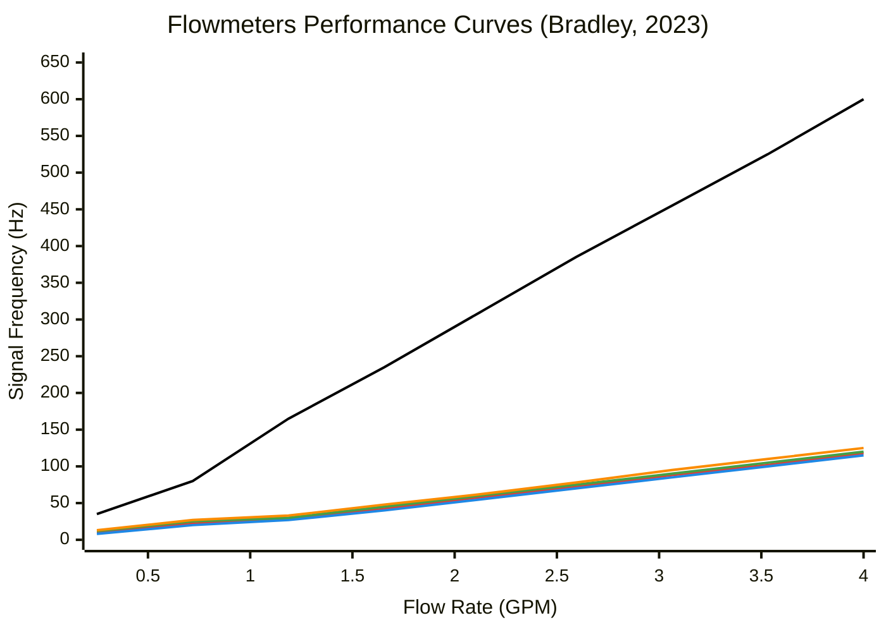
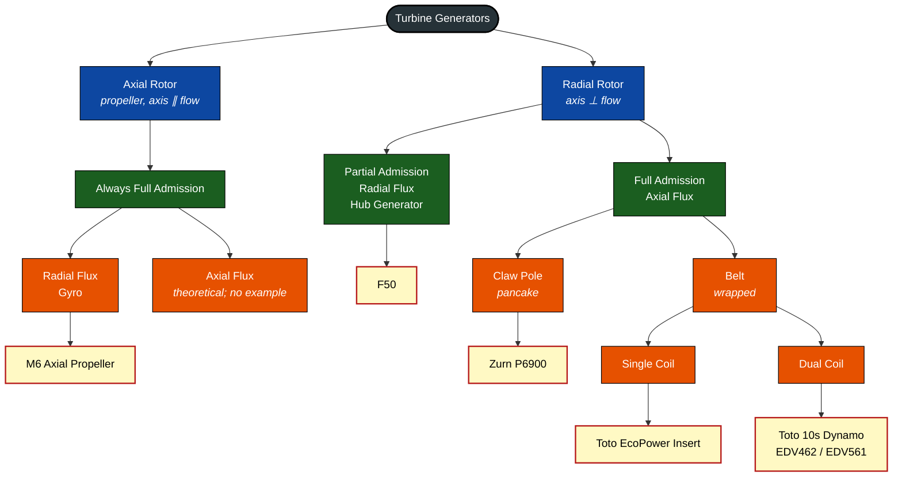
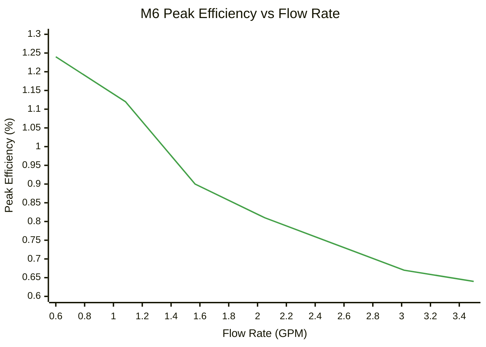
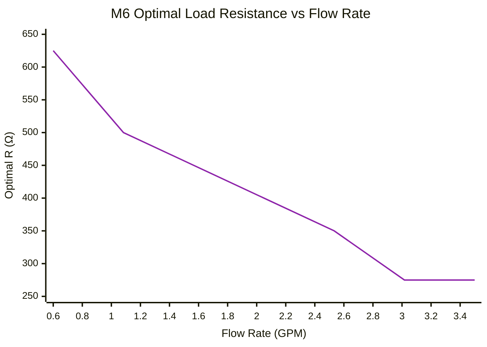
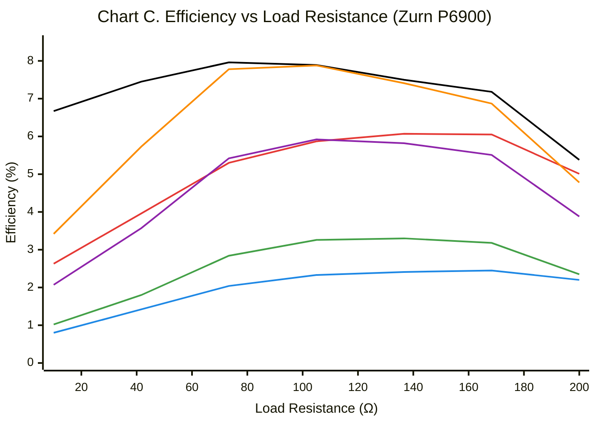
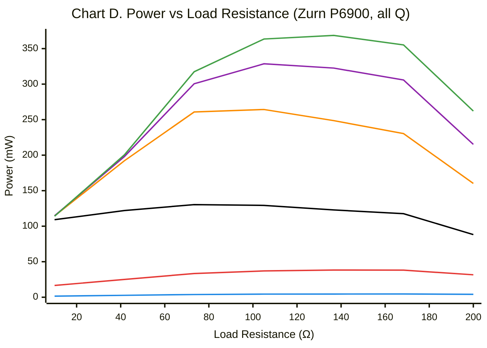
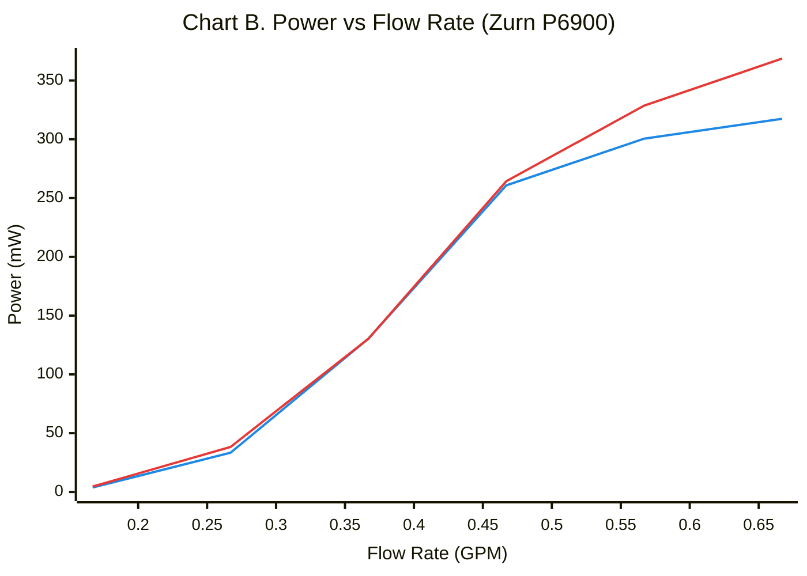
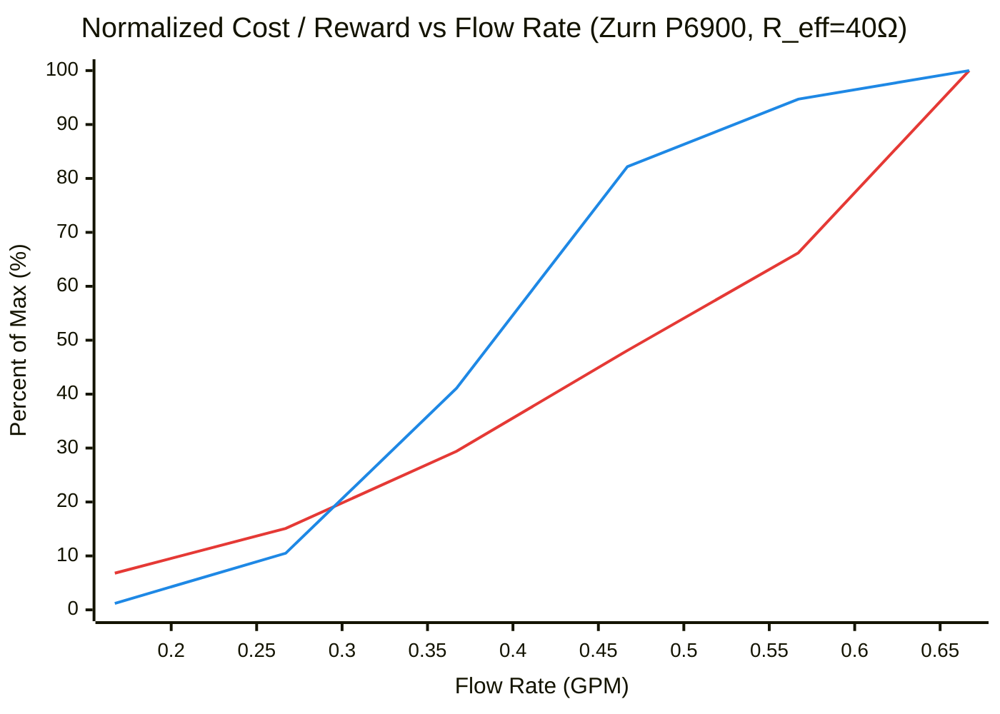

# Flow Sensing & Power Generation for IoT

**Watts Water Technologies**

---

## Table of Contents

1. [Overview & Background](#1-overview--background)
2. [Flow Sensing](#2-flow-sensing)
3. [Turbine Generators](#3-turbine-generators)
4. [Design Constraints & Generator Modification](#4-design-constraints--generator-modification)
5. [Hybrid Systems: Generator + Meter + Storage](#5-hybrid-systems-generator--meter--storage)
6. [Turbine Selection Framework](#6-turbine-selection-framework)
7. [Application Examples](#7-application-examples)
- [Appendix A: Spec Template](#appendix-a-spec-template)
- [Appendix B: Catalogue: Flow Meters](#appendix-b-catalogue-flow-meters)
- [Appendix C: Catalogue: Generators](#appendix-c-catalogue-generators)

---

## 1. Overview & Background

This document is a master reference for flow sensing and power generation research conducted at **Watts Water Technologies**.

It covers flow metering technology selection, micro hydro turbine generator analysis, a classification system for turbine types, testing methodology, load strategies, and a catalogue of all devices evaluated. A turbine selection framework and worked application examples are provided at the end.

**Design priorities across all applications:**

- Low cost
- Accurate at low flow rates
- Low power consumption
- Potential for self-powered IoT (no wired power, no battery replacement)

### 1.1 Why Rotary? Why 0-4 GPM?

The scope of this document is **0-4 GPM**. This range covers the fixtures of interest: bottle fillers, drinking stations, kitchen sinks, restroom sinks, and residential showers. Most single fixtures fall below 2 GPM; the 4 GPM ceiling accommodates multi-fixture configurations such as up to four sinks sharing one sensor, without changing the technology selection.

Rotary sensing measures volume directly by counting spinner revolutions rather than inferring flow from pressure. At low flow rates, $\Delta P$ across any restriction is too small to measure reliably; a spinning turbine at 0.5 GPM produces a clear, countable pulse train. Above 4 GPM, differential pressure sensing takes over as the practical choice.

### 1.2 Prior Work

An initial IoT Technology Readiness Report was prepared at Bradley, which benchmarked and tore down competitor faucets (U by Moen, Delta Essa VoiceIQ), independently confirming the GEMS 238600 turbine in both and validating it as the optimal sensing element. That report also identified differential pressure sensing as a viable approach for higher-flow products (EFX emergency showers at 15-30 GPM), and suggested continued research into turbine generators for self-powered applications, which is where this document continues.

---

## 2. Flow Sensing

### 2.1 Technology Survey

| Technology | Principle | Strengths | Weaknesses | Best Fit |
|---|---|---|---|---|
| **Rotary (Turbine / Paddle)** | Spinning element; RPM proportional to flow | Low cost, good low-flow accuracy, insertable | Moving parts, wear | 0.08-8 GPM |
| **Positive Displacement** | Fluid fills/empties fixed chambers | Good at low flow | Many moving parts, high $\Delta P$, complex housing | 0.25-2 GPM |
| **Differential Pressure** | $\Delta P$ across restriction proportional to $Q^2$ | No moving parts, cheap sensors | Poor at low flow/pressure | >4 GPM |
| **Ultrasonic** | Transit time of sound | Non-invasive, no $\Delta P$ | Expensive, special housing | High accuracy needs |
| **Magnetic** | Faraday's law on conductive fluid | Non-invasive, accurate | Needs conductive particles, expensive | Industrial |
| **Thermal / Coriolis** | Heat transfer or mass flow | Very accurate | Expensive, power-hungry | Not in scope |
| **Vortex Shedding** | Oscillating vortices behind bluff body | Accurate, no moving parts | Min flow >2 GPM, high $\Delta P$, long length | >2 GPM |
| **Vane / Piston** | Spring-loaded vane deflects with flow | Wide range, low-flow capable | Mechanical complexity, spring | Similar to turbine |

### 2.2 Rotary Sensors: Radial vs. Axial

| Type | Description | Min Flow | Notes |
|---|---|---|---|
| Radial / Paddle Wheel | Only part of rotor in flow path | ~0.1-0.25 GPM | Cheaper, less accurate at low flow |
| Axial / Inline | Full propeller inline; Hall effect reads blades | ~0.05-0.08 GPM | Better low-flow sensitivity |

Paddle-wheel meters (Gredia, Sea YF-S201, Uxcell) require higher flow to start spinning. Axial turbines (GEMS 238600, Sika VY10, Auk Mueller MT5) offer superior low-flow performance. The GEMS 238600, available as a turbine element or full assembly, was selected as the primary sensing element based on in-house testing and competitor validation.

#### Flowmeters Performance Curves

Signal frequency vs. flow rate for five candidate rotary flow meters. All relationships are linear ($f = k \cdot Q$), as expected from direct pulse counting. The **GEMS 238600** produces roughly 4-5× the frequency-per-GPM of any other meter in the set, which is the primary reason it was selected: more pulses per unit volume means higher resolution at low flow, which is where fixture measurement lives.

**Legend:**

| | Meter | Slope (Hz / GPM) |
|---|---|---|
| ⬛ | **GEMS 238600** | ~150 |
| 🟥 | Sea YF-S201 | ~30 |
| 🟦 | Gredia FS200A | ~29 |
| 🟩 | Sika VY10 | ~31 |
| 🟧 | FS200A | ~32 |

*Data reproduced from Bradley in-house testing, 2023.*

### 2.3 Hall Effect Sensors

The turbine's embedded magnet is read by an external Hall effect sensor. The GEMS 238600 emits approximately **100 Gauss** at the sensor zone (measured in-house against a reference Hall sensor).

| Sensor | Supply Voltage | Active Current | Active Power | Sleep Current | $B_{OP}$ (Operate) | $B_{RP}$ (Release) | Key Advantage |
|---|---|---|---|---|---|---|---|
| **Allegro A1220** | 3-24V | 4 mA (always on) | ~12 mW @ 3V | N/A | 35 G typ | 15 G typ | Proven, wide voltage range |
| **Allegro A1171** | 1.65-3.5V | 3.5-12 μA | ~15-42 μW | 8 μA | 45 G typ | 30 G typ | ~800x lower power than A1220 |

Both operate comfortably with the 100 G field from the GEMS turbine. The A1171 is preferred for any battery-powered or energy-harvesting application.

---

## 3. Turbine Generators

This section introduces turbine generators and classifies them by physical form. The design-constraint framework and all experimental characterization follow in §4.

### 3.1 Goals & Operating Range

Many under-sink or inline applications need IoT capability but have no wired power. The goal is to generate usable electrical power from water flow at **0.5-1.0 GPM**, well below where most off-the-shelf generators are optimized.

Generators can optionally double as flow sensors since their output frequency and power output are both proportional to flow rate. This is covered in §4.5.

### 3.2 Magnet Magnetization

All rotating magnets in these generators must be **diametrically magnetized**: N/S poles on opposite sides of the magnet, perpendicular to the axis of rotation. As the magnet spins, the field alternates between N and S, inducing voltage. An axially magnetized magnet spinning on its own axis presents a constant field to a symmetric coil, producing no change in flux and no induced voltage. This is not a design variable; all generators in this catalogue use diametric magnetization.

### 3.3 Admission Types

Both full and partial admission use a directed jet of water to spin the rotor, but differ significantly in geometry and performance:

| Type | Description | Key Characteristic |
|---|---|---|
| **Full Admission** | Tight-tolerance nozzle directs a jet around the entire rotor circumference; all blades in flow at all times | Lower startup flow, higher $\Delta P$, precise machining required |
| **Partial Admission** | Simpler, smaller inlet hole; jet hits only a portion of the rotor at any moment | Higher startup flow, lower $\Delta P$, simpler geometry |

Full admission generators can start generating at lower flow rates, critical for the 0.5 GPM target. Partial admission hub generators sit outside the direct flow path and require a cage or nozzle structure to redirect the jet onto the blades.

### 3.4 Coil Configurations & Flux Types

#### Flux Types

| | Axial Flux | Radial Flux |
|---|---|---|
| **Flux vs rotation axis** | Parallel (flux lines run along the axis of rotation) | Perpendicular (flux lines run across the axis of rotation) |
| **Typical coil shape** | Pancake (claw pole) or wrapped cylinder (belt) | Small rings pointing inward, or ring-in-ring |
| **Flux guides needed?** | Yes, always required for both claw pole and belt variants | Typically no (spoke/gyro) |
| **Cycles per revolution** | Equal to the number of magnet pole pairs, matched by the number of claw-pole pairs in the flux guide | Equal to the number of magnet pole pairs |

#### Coil Configurations

| Our Name | Literature Name | Flux Type | Description | Example |
|---|---|---|---|---|
| **Claw pole** | Claw pole | Axial | Pancake coil above a cage of soft-iron claw legs that funnel flux from the spinning magnet through the coil. The number of claw poles sets the AC frequency per revolution. | Zurn P6900 |
| **Belt** | Axial flux wrapped | Axial | Coil wraps around the rotor cylinder, enclosing the magnet. Best flux coupling of the axial types. | Toto EcoPower insert, Toto 10s Dynamo (EDV462/EDV561) |
| **Spoke** | Hub generator | Radial | Multiple small coils facing inward; magnet ring spins outside them (outrunner). | F50 |
| **Gyro** | Radial flux ring | Radial | Ring spinning inside another ring. Streamlined for in-pipe mounting. | M6 axial propeller |

#### Belt Sub-Categories

- **Single coil:** One electrical circuit, two wires. e.g., Toto EcoPower insert.
- **Dual coil:** Two independent circuits, four wires. One coil is dedicated to always-on critical functions (solenoid valve, MCU); the other powers secondary functions (display, radio) that can be shed when insufficient power is being generated. The Toto 10s Dynamo (EDV462/EDV561) uses this design with a high-inductance secondary coil. Toto advertises that just 10 seconds of water flow generates enough stored energy to fully initialize the electronics, with the inductance sustaining power briefly after flow stops to ensure clean valve closure and final sensor reads. The tradeoff is that high inductance increases braking on the rotor.

#### Three-Phase (Spoke/Hub)

Six diodes in hub generators confirm 3-phase generation (3-phase bridge rectifier). Benefits over single phase: smoother and more continuous power delivery, even rotor braking. Reduced DC ripple is useful for stable power delivery but a disadvantage if ripple frequency is being used to infer rotor RPM. In that case a single-phase or unfiltered output is preferable (see §4.5).

> **Note on coupling:** The real-world flux linkage between magnet and coil depends on geometry, air gap, material permeability, and other factors that are difficult to measure directly without a gaussmeter. For comparative analysis between turbines, this is treated as a lumped experimental parameter derived from open-circuit testing rather than calculated from first principles.

### 3.5 Physics: Power Generation

#### What Drives Output Power

At a fixed load resistance, the voltage induced in the coil depends on coil turns ($N$), magnet strength ($B$), coil area ($A$), and rotor angular velocity ($\omega$). In the **linear regime** (moderate $\omega$, no magnetic saturation, rotor not yet braking-limited) output power scales with $V^2$ and therefore approximately with $\omega^2$ and $Q^2$. At higher flow rates this breaks down: voltage flattens as electromagnetic braking, bearing drag, and rotor hydrodynamic losses grow faster than available torque, so power rises sub-quadratically and eventually asymptotes.

Increasing any of $N$, $B$, $A$, $\omega$ increases both output voltage and electromagnetic braking on the rotor. Of those four variables, each increases output and braking together. Two separate levers help without a direct braking penalty:

- **Thicker wire (lower $R_{coil}$):** Lowers coil resistance without changing magnetic coupling. Less power dissipated internally as heat; more delivered to the load.
- **More water pressure:** Increases torque available to overcome braking. Pure energy input.

#### Why Each Generator Has a Power Sweet Spot

At very low flow rates, friction and bearing losses consume a disproportionate share of the available hydraulic power, and electrical output is low. As flow increases, output power rises. Electromagnetic braking also rises with rotor speed, and at high flow rates the braking torque becomes significant enough that additional water energy is increasingly lost rather than converted. Efficiency therefore peaks at an intermediate flow rate, the turbine's natural sweet spot.

This sweet spot is turbine-specific and determined experimentally. Some turbines, particularly the axial propeller type, show no interior sweet spot: efficiency decreases monotonically from the lowest tested flow rate, meaning the lowest flow rate is always the most efficient operating point. Both cases are handled by the load-strategy framework in §4.3.

#### Pressure vs. Flow Rate

$$P_{hydraulic} = \Delta P \cdot Q$$

Pressure ($\Delta P$) provides torque; flow rate ($Q$) provides rotor speed. Both are needed. A high-pressure, zero-flow system produces no power, and a high-flow, zero-pressure system produces no power. At a fixed load, output power rises with both but is ultimately bounded by the rotor's mechanical limits at high flow rates.

#### Efficiency

$$\eta = \frac{P_{electrical}}{P_{hydraulic}} = \frac{P_{load}}{\Delta P \cdot Q}$$

> Convert GPM to m³/s and PSI to Pa for SI unit consistency.

### 3.6 Classification System & Family Tree

Turbine generators are classified by rotor orientation, admission type, flux direction, and coil configuration. **These axes are independent.** An axial rotor could theoretically pair with axial flux coils, though no commercial example in this scope has been found.

#### Rotor Types

- **Axial rotor (propeller):** Axis parallel to water flow. Water hits all blades simultaneously. Always full admission.
- **Radial rotor:** Axis perpendicular to water flow. Can be full or partial admission.

#### Family Tree

*Legend: 🟦 rotor type · 🟩 admission · 🟪 flux / coil configuration · 🟨 commercial example*

---

## 4. Design Constraints & Generator Modification

Classification tells us what candidate devices exist. This section establishes the criteria that govern selection (§4.1), describes the bench procedure that populates those criteria (§4.2), turns the resulting data into a fixed load resistance per turbine (§4.3), walks the full procedure on the Zurn P6900 as a worked example (§4.4), and covers the generator-output types and modifications required to use the generator as a flow sensor (§4.5-§4.7).

### 4.1 Completing Criteria for Rotary Flowsense Selection

To select a device for a given product, two time-varying profiles and a set of constraint inputs must be matched against the device's measured capabilities.

**Governing profiles:**

- **Power demand over time.** How much power does the product need, and when? Always-on, only during flow, or bursty (radio transmit)?
- **Flow over time.** How much water passes through, and when? Continuous, intermittent, or dormant for long periods?

**Constraint inputs:** pressure budget, price budget, sensing accuracy, physical envelope, and any application-specific requirements (NSF, PID compliance, fitting type, sealed housing).

**Shortcut for simple cases.** If the product allows a wired supply or a replaceable battery, the answer is a GEMS 238600 paired with an Allegro A1220 (wired) or A1171 (battery) Hall sensor. The framework below applies to the harder case of sealed, long-life, or self-powered deployments, though it handles the simple cases as well.

#### Five Output Configurations

Every rotary flowsense decision resolves to one of the following:

| # | Configuration | Sensing | Power | Handles Zero Flow | Handles Ultra-Low Flow | Appendix Fields Queried |
|---|---|---|---|---|---|---|
| 1 | Flow meter + battery | Dedicated meter (GEMS + A1171 or A1220) | Battery (or wired) | Yes (sleep) | **Ultra-low** (GEMS min ≈ 0.08 GPM) | App. B: min flow, active/sleep power |
| 2 | Turbine alone | None | Turbine output | No | **None** (regulated turbine) | App. C: min flow, $R_{eff}$ or $R_{max}$, peak power |
| 3 | Turbine as sensor | Power at fixed load, or AC / ripple frequency | Turbine output | No | **Medium** (turbine as sensor, limited by loaded $Q_{start}$) | App. C: $R_{eff}$, peak power, $\Delta P$ profile |
| 4 | Turbine + internal Hall | Internal Hall pulses (load-independent) | Turbine output + small battery | Yes (battery) | **Low\*** (turbine with Hall, open-circuit sensing; additional testing required per turbine) | App. C: min flow, $Q_{start}$, peak power |
| 5 | Paired meter + turbine + battery | Dedicated meter | Turbine + battery trickle-charge | Yes (battery) | **Ultra-low** (meter sets the floor) | App. B + App. C |

*\*Configuration 4 pushes minimum detectable flow below the turbine's loaded $Q_{start}$, but exactly how low depends on bearing drag, magnetic detent, and rotor inertia at the Hall sensor's threshold. This must be measured per turbine as part of the bench procedure in §4.2.*

#### Two Cross-Cutting Robustness Requirements

Every configuration must be evaluated against two failure modes:

- **Zero-flow events.** No water moving. The system must remain responsive (wake-on-flow) without draining the battery or losing state. Addressed by sleep mode (§5.3) and a low-power wake comparator.
- **Ultra-low-flow / insufficient-power events.** Flow is present but below the turbine's usable threshold. The generator produces voltage but not enough to run the load. Addressed by open-circuit sensing mode (§4.7) and stored-energy buffering (§5.2).

Configurations 1, 4, and 5 handle both modes. Configurations 2 and 3 fail silently during either mode and are only appropriate where continuous minimum flow is guaranteed.

### 4.2 Testing & Experimental Procedure

The procedure below is run once per turbine and produces the raw data that populates Appendix C, feeds the load-strategy selection in §4.3, and ultimately enables the selection algorithm in §6.

#### Test Rig Setup

1. Set target flow rate ($Q$)
2. Measure $\Delta P$ across the device
3. With the coil leads open (no load), sweep flow up from zero and record the minimum $Q$ at which any non-zero voltage appears across the open circuit. The voltage magnitude is not important, only that it is readable; a non-zero reading confirms the rotor has started spinning. Also record $\Delta P$ vs. $Q$ with no load as the hydraulic-only baseline.
4. Measure $R_{coil}$ (done once per turbine)
5. Connect variable resistor; sweep full range at each $Q$, recording $V_{load}$, current, frequency
6. Calculate efficiency at each $(Q, R)$ point
7. Step up flow rate and repeat from 0-4 GPM

> **Note on regulated-DC units:** Turbines with built-in regulators (e.g., Zurn P6900) are tested by opening the housing, disconnecting the internal battery and regulator, and tapping the two raw coil leads directly. The regulator flattens flow-dependent information and cannot be characterized by an external R-sweep. For off-the-shelf use the built-in regulator is the product; for benchtop characterization the raw coil output is what gets swept.

#### Measurements Per Flow Rate

| Measurement | Symbol | Notes |
|---|---|---|
| Flow rate | $Q$ (GPM) | Set value |
| Differential pressure (loaded) | $\Delta P$ | Across the device under a connected load |
| Differential pressure (open circuit) | $\Delta P_{oc}$ | Across the device with coil leads open; hydraulic-only baseline |
| Minimum startup flow (open circuit) | $Q_{start}$ | Lowest $Q$ at which any non-zero voltage appears across the open circuit |
| Coil resistance | $R_{coil}$ | DC, measured once per turbine |
| Load resistance (swept) | $R_{load}$ | Full range at each $Q$ |
| Voltage at each $R_{load}$ | $V_{load}$ | Measured across the load |
| Power at each $R_{load}$ | $P$ | Calculated: $V^2/R_{load}$ |
| Efficiency at each $R_{load}$ | $\eta$ | Calculated: $(V^2/R_{load}) / (\Delta P \cdot Q)$ |
| AC frequency | $f$ | Proportional to flow rate; usable for sensing (see §4.5) |

#### Why Open-Circuit Testing Matters

The open-circuit sweep establishes the absolute minimum flow at which the rotor will spin with zero electromagnetic braking. This is the floor for open-circuit sensing mode (§4.7), where the load is disconnected and the system runs on a small battery to read rotor pulses at very low flow. Whatever minimum flow the turbine achieves under load, it will achieve a lower minimum with the load removed. That delta is the reason open-circuit sensing is worth the extra MOSFET and battery.

#### Experimental Isolation Procedure

| Step | What | Method | Variables Isolated |
|---|---|---|---|
| **1. Teardown** | Direct measurement | Count turns/poles, measure with multimeter/calipers | $N$, $A$, $r$, $R_{coil}$, coil geometry |
| **2. Open circuit** | No load | Measure frequency and $\Delta P_{oc}$ at several $Q$ points | lumped flux coupling, friction/efficiency ratios |
| **3. Loaded** | Known $R_{load}$ connected | Measure $V_{load}$, $I$, $\omega$; back-calculate | $\eta_{turbine}$ |
| **4. Post-processing** | Separate ratios using $\eta_{turbine}$ | Compute from step 2 and step 3 data; subtract known losses to isolate remaining friction terms | $c_f$ (viscous friction), $\tau_0$ (static friction) |

**Can measure directly:** $R_{coil}$, wire gauge, pole/claw count, coil ID/OD, rotor type, admission type, flux type.

**Cannot currently measure:** $B$ (no gaussmeter), $L$ (LH meter TBD). Since $B$ cannot be measured directly, the flux coupling is treated as a single lumped experimental constant.

#### Interpolating Between Tested Resistances (Optional)

All reported $R_{eff}$, $Q_{eff}$, $R_{max}$ values and all Cost/Reward charts use measured $(R, V, Q, \Delta P)$ points directly with no extrapolation. In principle, a Thevenin source model

$$V_{load} = V_{source} \cdot \frac{R_{load}}{R_{source} + R_{load}}$$

fit to a few measured points per flow rate could predict $V$ at untested resistances. In practice, finding $R_{eff}$ requires a dense R-sweep at multiple $Q$ anyway to locate the efficiency peak, so the model provides no testing shortcut. It would only be useful for generating smooth visual curves after the fact. Measured points are sufficient for all selection decisions.

### 4.3 Load Strategies

Once the bench data is in, the next question is what resistor to connect to the coil in the product. This is an experimental decision that cannot be predicted from geometry alone because it depends on coil impedance, rotor drag, and magnetic coupling that cannot all be measured directly (see §4.2). The R-sweep at each flow rate produces a family of efficiency and power curves, and the load-strategy framework below converts those curves into one fixed resistor value per turbine.

Picking the flow rate that produces the most raw power is tempting but wrong. Raw power keeps climbing well past the point where $\Delta P$ has blown through any realistic pressure budget, and voltage flattens as the rotor approaches its electromagnetic limit, meaning additional water energy yields diminishing electrical returns. The useful operating point is the one that balances power out against hydraulic cost: the efficiency peak.

#### Key Terms

| Symbol | Name | Definition |
|---|---|---|
| **$R_{eff}$** | Peak-efficiency resistance | Single fixed resistance at which the turbine achieves greatest efficiency across all tested flow rates. One value per turbine. |
| **$Q_{eff}$** | Peak-efficiency flow rate | Flow rate at which that greatest efficiency occurs. The turbine's natural sweet spot. |
| **$R_{max}$** | Asymptotic optimal resistance | Applies only when minimum tested flow rate is also the most efficient (no interior sweet spot). The asymptote approached by optimal $R$ as $Q$ increases. Used as the fixed load for these turbines. |

#### Selection Procedure

**Step 1. Open-circuit baseline.** With the coil leads open, sweep flow up from zero and record (a) $Q_{start}$, the minimum flow at which any non-zero voltage appears across the open circuit, and (b) $\Delta P_{oc}$ vs. $Q$, the hydraulic-only baseline with no electromagnetic braking.

**Step 2. Measure internal resistance.** Measure $R_{coil}$ with a multimeter. The experimentally optimal load will typically be higher than $R_{coil}$ because the coil's AC source impedance includes inductive reactance ($\omega L$) in addition to $R_{coil}$. The true optimum is determined by the sweep in Step 3, not by a simple DC impedance-matching rule.

**Step 3. Efficiency vs. resistance sweep.** At each flow rate $Q$, sweep load resistance and calculate:

$$\eta = \frac{V_{load}^2 / R_{load}}{\Delta P \cdot Q}$$

This produces a family of curves, one per flow rate, plotted on the same axes.

**Step 4. Identify $R_{eff}$ and $Q_{eff}$ (or $R_{max}$).** Find the single point of greatest efficiency across all $(Q, R)$ combinations.

- **Interior sweet spot found:** that resistance and flow rate are $R_{eff}$ and $Q_{eff}$. Use $R_{eff}$ as the fixed load.
- **Minimum flow rate is always most efficient:** no interior sweet spot. Plot optimal $R$ vs. $Q$; the curve approaches an asymptote, $R_{max}$. Use $R_{max}$ as the fixed load. Selection is then driven by pressure budget or power need.

**Sanity check.** The voltage vs. flow curve should begin to flatten at or near $Q_{eff}$. This is the same electromagnetic saturation behavior that makes operation at higher flow rates wasteful, and serves as an independent confirmation of the efficiency-based peak.

**Flatness observation.** Changing load resistance within a reasonable range around the optimum typically produces only modest changes in power and efficiency. A well-chosen fixed load captures nearly all the available benefit without the cost and complexity of a real-time dynamic system, though this should be verified per turbine as data becomes available.

#### Fixed Load Selection Rule

| Turbine Type | Fixed Load | Notes |
|---|---|---|
| Has interior $Q_{eff}$ | **$R_{eff}$** | Best efficiency at the turbine's natural sweet spot |
| Min flow = $Q_{eff}$ | **$R_{max}$** | No single optimal flow rate; selection by pressure budget or power need |

#### Worked Example: M6 Axial Propeller (the $R_{max}$ Case)

The M6 axial propeller illustrates the second branch of the rule. Full R-sweep at seven flow rates (0.60-3.50 GPM, $R_{coil} = 161.6\ \Omega$) shows **no interior efficiency peak**. Efficiency is highest at the lowest tested flow rate and decreases monotonically as $Q$ rises, which is characteristic of axial-propeller geometry.

*Peak efficiency at each tested flow rate; $R_{coil} = 161.6\ \Omega$.*

Because no single flow rate is best, the load is chosen by looking at the optimal resistance at each $Q$. Optimal $R$ decreases with increasing $Q$ and approaches an asymptote near $275\ \Omega$.

*Optimal load resistance at each tested flow rate; asymptote at $R_{max} \approx 275\ \Omega$.*

$R_{max} \approx 275\ \Omega$ is the fixed load selected for the M6. Because peak efficiency occurs at the low-flow end of the range, final operating-point selection is driven by the pressure budget and power need for the target application rather than by a single sweet-spot flow rate. M6 peak power ranges from ~3 mW at 0.60 GPM ($\Delta P \approx 1$ PSI) to ~490 mW at 3.50 GPM ($\Delta P \approx 50$ PSI), with efficiency steadily degrading across that range.

**Contrast with Zurn P6900 (§4.4):** the Zurn has a clear interior $Q_{eff}$ at 0.33 GPM and uses a single $R_{eff}$. The M6 has no interior peak and uses an $R_{max}$ asymptote. These two turbines demonstrate both branches of the selection rule in practice.

#### Pre-Programmed Dynamic Load (Optional)

A lookup table indexed by flow rate can switch between a small set of resistors, populated from bench test data and not real-time. Adds ~$2-5 BOM. Only worth considering when the operating range spans >3:1 flow ratio and optimal $R$ shifts dramatically across that range. For most 0-4 GPM applications, a fixed $R_{eff}$ or $R_{max}$ is preferred.

#### Standard Output Charts Per Turbine

Once the fixed load is chosen, each turbine is characterized by two summary quantities plotted together on a single **normalized Cost/Reward chart**:

- **Cost:** $\Delta P$ vs. $Q$, the hydraulic cost imposed on the system
- **Reward:** Power vs. $Q$, the electrical output at the chosen fixed load

Both are expressed as percent of their respective turbine-specific maximum, so they share a single axis. Conversion factors back to engineering units are given per-turbine in the caption. §4.4 shows the full workflow applied to the Zurn P6900.

### 4.4 Test Results: Zurn P6900 Demo

The Zurn P6900 is the primary demonstration unit with complete bench data including full flow rate sweep and full resistance sweep at each flow rate. The unit is natively regulated DC; these results were taken with the battery and regulator disconnected, tapping the two raw coil leads directly (see §4.2 note). It serves as a concept demonstrator (good operating range, clean $\Delta P$ vs $Q$ curvature, clear interior $Q_{eff}$), not a product recommendation. This is the $R_{eff}$ / $Q_{eff}$ branch of the selection rule; for the contrasting $R_{max}$ case, refer to the M6 worked example in §4.3. All other turbines in Appendix C will follow this same format as data becomes available.

Measured coil resistance: $R_{coil} = 3.6\ \Omega$.

#### Step 1: Efficiency vs. Load Resistance (Finding $R_{eff}$ and $Q_{eff}$)

The efficiency sweep produces one curve per flow rate. The global peak across all $(Q, R)$ combinations identifies $R_{eff}$ and $Q_{eff}$.

**Legend:**

| | Flow Rate | Peak $\eta$ |
|---|---|---|
| 🟦 | 0.17 GPM | 2.5% |
| 🟥 | 0.25 GPM | 6.1% |
| ⬛ | **0.33 GPM ($Q_{eff}$)** | **8.0%** |
| 🟧 | 0.42 GPM | 7.9% |
| 🟪 | 0.50 GPM | 5.9% |
| 🟩 | 0.67 GPM | 3.3% |

The global maximum sits on the $Q = 0.33$ GPM curve at $R = 40\ \Omega$, with $\eta \approx 8.0\%$. No higher efficiency is reached at any other flow rate or resistance in the tested range.

#### Step 2: Power vs. Load Resistance (Confirming Flatness)

Plotting power at the same $(Q, R)$ grid confirms that the optimum is broad. Small deviations from $R_{eff}$ produce only modest power changes, supporting the use of a single fixed resistor rather than a dynamic load.

**Legend:**

| | Flow Rate | Peak Power |
|---|---|---|
| 🟦 | 0.17 GPM | ~5 mW |
| 🟥 | 0.25 GPM | ~38 mW |
| ⬛ | **0.33 GPM ($Q_{eff}$)** | **130 mW** |
| 🟧 | 0.42 GPM | ~264 mW |
| 🟪 | 0.50 GPM | ~329 mW |
| 🟩 | 0.67 GPM | ~369 mW |

Voltage flattening is visible as the sanity check described in §4.3: at $R = 20\ \Omega$, $V$ climbs from 1.96 V at $Q = 0.42$ GPM only to 2.00 V at $Q = 0.67$ GPM despite $\Delta P$ more than doubling. Additional water energy is no longer producing proportional electrical output.

#### Selection

- $R_{eff} = 40\ \Omega$
- $Q_{eff} \approx 0.33$ GPM
- Peak efficiency $\eta_{max} \approx 8.0\%$
- Interior peak confirmed ($R_{max}$ path does not apply)

At $Q = 0.67$ GPM, $\Delta P$ reaches 38.5 PSI, well above a realistic 50 PSI pressure budget once system losses are included, while power has only climbed ~22% over its $Q_{eff}$ value. The efficiency-based $Q_{eff}$ is the correct operating point.

#### Step 3: Power vs. Flow Rate (Static $R_{eff}$ vs. Dynamic Optimal)

With $R_{eff}$ fixed, power vs. flow rate can be plotted and compared against the theoretical ceiling of a continuously-optimized load. The two lines touch at $Q_{eff}$ and separate as $Q$ grows because the optimal $R$ shifts to $60\text{-}80\ \Omega$ at higher flow rates.

**Legend:**

| | Load Strategy |
|---|---|
| 🟦 | Static load at $R_{eff} = 40\ \Omega$ |
| 🟥 | Dynamic optimal $R$ per $Q$ (theoretical max) |

The static-load curve captures the large majority of the theoretical maximum across the full operating range, with the largest gap (~14%) at $Q = 0.67$ GPM where $R$ shifts furthest from $40\ \Omega$. For a fixed-load design the $R_{eff}$ choice is robust.

#### Step 4: Normalized Cost / Reward vs. Flow Rate (Summary)

The standard per-turbine summary, with Cost ($\Delta P$) and Reward (electrical power at $R_{eff}$) plotted on a single shared axis. Both are normalized to their respective turbine-specific maxima, so the y-axis is percent-of-max. This allows a single chart with two series instead of a dual y-axis plot.

**Legend:**

| | Series | Conversion to Engineering Units |
|---|---|---|
| 🟥 | Cost ($\Delta P$ as % of 38.5 PSI max) | $\Delta P$ [PSI] = cost% $\times$ 0.385 |
| 🟦 | Reward (Power at $R_{eff}$ as % of 317.4 mW max) | $P$ [mW] = reward% $\times$ 3.174 |

Interpretation: the Reward curve rises steeply through $Q_{eff} = 0.33$ GPM, reaching 41% of its maximum output while Cost is still at only 29% of its maximum. Above $Q_{eff}$ the Reward curve flattens while the Cost curve continues to climb, so the gap between them narrows and eventually inverts. The crossover near $Q = 0.42$ GPM (Cost = 48%, Reward = 82%) marks where additional flow begins buying proportionally less electrical return. This is the visual summary produced for every turbine in Appendix C as bench data becomes available.

### 4.5 Generator Output Types and Sensing Options

A turbine generator can double as a flow sensor because its output is proportional to rotor speed, which is proportional to flow rate. This subsection covers how to extract flow rate from a generator's output and which output types support it.

The table below addresses sensing from the electrical output terminals only. A separate internal-Hall option (§4.6 Method 1) works on all three output types but requires physical access to the rotor body; for an off-the-shelf regulated-DC unit this means opening the housing and moving to a custom assembly.

| Output Type | Built-in Circuit | Sensing from electrical output? | How |
|---|---|---|---|
| **Raw AC** | None | Yes, best option | Frequency counting or power at fixed load |
| **Unregulated DC** | Diode bridge | Yes | Power proportional to flow at known load; ripple frequency also usable, though heavy filtering kills ripple amplitude |
| **Regulated DC** | Voltage regulator | No, information lost | Output held constant regardless of flow. Any flow sensing requires an internal Hall sensor (§4.6 Method 1), which means opening the housing. No longer an off-the-shelf part. |

#### Rectification

| Generator Type | Rectification |
|---|---|
| Single-coil, 2-wire | Standard bridge rectifier + smoothing cap |
| 3-phase hub generator | 3-phase full-wave rectifier (6 diodes) |
| Dual-coil, 4-wire | Separate rectification per coil, then combine |

### 4.6 Sensing Methods: Priority Order

**1. Hall effect sensor inside the turbine body (preferred where physically possible)**

A Hall sensor mounted inside the generator housing reads the rotor's magnet directly, the same approach used in dedicated flow meters (§2). It produces a clean digital pulse train whose frequency is proportional to RPM and therefore flow rate, completely independent of the electrical load. The load can be anything (static, dynamic, open, shorted) and the Hall signal stays valid. Combined with an A1171 (~15-42 μW), this is the most power-efficient sensing method and the only viable sensing method for regulated-DC output turbines.

Caveat for regulated-DC off-the-shelf units: adding an internal Hall sensor requires opening the housing and modifying the assembly, so the product is no longer an off-the-shelf part. For sealed regulated-DC generators with a small external field leak, a clip-on external Hall detector can sometimes be used instead, but sensitivity is geometry-dependent and not reliable as a general approach.

**2. Power at a known static load (secondary)**

With a fixed, known load resistance, output power at a constant load scales with flow rate, but only under constant inlet pressure. The $P \propto Q^2$ relationship holds in the linear regime at fixed $\Delta P$. In a real plumbing system, upstream pressure fluctuates with building demand, valve position elsewhere on the line, and time of day, so the same flow rate can produce noticeably different power readings. Voltage, or better yet rotor frequency via a Hall sensor, is the preferred flow proxy because it responds to rotor speed directly and is insensitive to pressure swings that move the operating point along the turbine's power curve without changing $Q$ itself.

Power-at-fixed-load is cheapest (no additional sensor beyond the load resistor and a voltage measurement) and is acceptable where inlet pressure is known to be stable or where flow accuracy requirements are modest. Not available on regulated-DC output.

**3. AC frequency or DC ripple frequency (fallback)**

Raw AC zero-crossings or unregulated DC ripple frequency are both proportional to flow rate. Requires Raw AC or Unregulated DC output. Heavy downstream filtering should be avoided if using this method, as it reduces ripple amplitude. Valid fallback only if the turbine cannot physically accommodate a Hall sensor.

### 4.7 Open Circuit Sensing Mode

With no load connected ($R_{load} = \infty$), electromagnetic braking is removed and the turbine spins more freely, pushing the minimum detectable flow rate lower than under load. Flow rate is read from AC frequency or a Hall sensor. This mode requires a MOSFET switch to disconnect the load and a stored energy source (battery or supercapacitor) to power the sensing circuit.

The system can switch dynamically: open circuit at very low flows for maximum sensitivity; closed circuit at higher flows for power generation. See §5.3 for how this fits into the overall operating state model.

---

## 5. Hybrid Systems: Generator + Meter + Storage

### 5.1 Configuration Options

| Option | Sensing | Power | Description |
|---|---|---|---|
| **A. Generator only** | Hall sensor on generator rotor | Generator output | Hall sensor reads RPM for flow; generator powers everything. Load choice is independent of sensing. Most flexible. |
| **B. Generator power sensing** | Power at fixed load | Generator output | Read power at $R_{eff}$ as flow proxy. No separate sensor. Cheapest if a static load is acceptable. |
| **C. Paired meter + generator + battery** | Dedicated flow meter (e.g., GEMS + A1171) | Generator output + battery | Meter handles sensing; generator handles power; battery bridges zero-flow gaps. Most complete for accuracy. |

### 5.2 Storage Strategies

| Strategy | Description | Trade-off |
|---|---|---|
| Generator only | All power from flow | Fails at zero/very low flow |
| Generator + supercapacitor | MCU wakes on accumulated charge | Low cost, limited burst energy |
| Generator + rechargeable battery | Trickle-charge during flow | Best coverage; adds cost |
| Paired meter + generator + battery (Option C above) | GEMS for sensing; generator for power; battery bridges gaps | Most complete solution |

> **Open question:** At what minimum flow rate can each generator reliably trickle-charge a backup battery?

### 5.3 Operating States & Sleep Mode

Both flow sensing and power generation are intermittent. A restroom faucet may run only minutes per day; a bottle-filling station filter may process its entire 2,000-gallon life over months. The distinction between active and sleep states dominates total energy budget.

| State | Condition | Power Draw | Power Source |
|---|---|---|---|
| **Active. Generating** | Water flowing, load connected | MCU + Hall sensor + radio (5-50 mW typical) | Turbine output; charges battery simultaneously |
| **Active. Sensing Only** | Water flowing, load open | MCU + Hall sensor only (~0.1-1 mW) | Battery; braking minimized, extending low-flow sensitivity |
| **Sleep** | No water flow | MCU in deep sleep (~1-100 μW) | Battery only |

The system can switch between generating and sensing-only states dynamically based on flow rate. Sensing-Only mode requires a MOSFET load-disconnect; the "Generator only" strategy in §5.2 (no battery) cannot support this state.

**Wake detection from sleep:**

- **Flow-triggered wake (preferred):** Low-power comparator monitors Hall signal or raw AC at ~1-10 μA quiescent. Detected pulse wakes MCU. Most energy-efficient.
- **Periodic polling:** MCU wakes on a timer and checks for flow. Simpler firmware but wastes energy during long no-flow periods.

**Turbine selection implication:** If the generator requires 0.5 GPM to produce voltage but the application needs to detect flow at 0.1 GPM, a dedicated low-power Hall sensor (e.g., GEMS + A1171, min flow 0.08 GPM) is needed alongside the generator: the paired Option C configuration.

> Specific circuit topology for sleep switching and battery management is out of scope. Design principle: size the battery to cover expected sleep duration at sleep current draw; size the turbine to replenish it within a normal active flow event.

---

## 6. Turbine Selection Framework

### 6.1 Input Criteria

| Input | Description | Default / Notes |
|---|---|---|
| **Flow range (GPM)** | Expected operating range; assume normal distribution | Required |
| **Power needs** | Average power when running (mW) or energy per gallon (mWh/gal) | Required |
| **Sensing?** | Yes / No | Required |
| **Pressure budget (PSI)** | Maximum allowable $\Delta P$ across the turbine | Default 50 PSI. Legal min 25 PSI, legal max 80 PSI |
| **Price budget** | Maximum unit cost | Optional. If unknown, becomes a visualization axis |

### 6.2 Product Tiers

| Tier | What's Included | Added Requirements | Out of Scope |
|---|---|---|---|
| **Raw AC** | Turbine only (or regulated-DC unit with accessible coil leads) | None | Product-ready regulated DC output |
| **Raw AC + Sensing** | Turbine + Hall sensor inside body + load shutoff switch + small battery | Battery pre-charged; system detects when generation stops and switches to open-circuit sensing | Regulated DC product, specific MCU firmware |

Regulated-DC units (e.g., Zurn P6900) can be used as a raw-AC tier only by opening the housing and tapping the coil leads directly. This is a benchtop / custom-housing path, not an off-the-shelf one. Making regulated DC from scratch is out of scope for turbine selection.

### 6.3 Selection Logic

1. **Filter by flow range:** Focus on turbines where $Q_{eff}$ (or $R_{max}$ operating range) overlaps the most probable flow rates.
2. **Filter by pressure budget:** Use the Cost portion of the normalized Cost/Reward chart per turbine. Eliminate turbines whose $\Delta P$ at the expected flow rate exceeds the budget.
3. **Check power output:** Confirm output meets power need at expected flow rate. Convert if needed:

$$\text{mWh/gal} = \frac{P_{mW}}{Q_{GPM} \times 60}$$

> Derivation: energy per gallon = $P / Q$. With $P$ in mW and $Q$ in GPM, mWh/gal $= P \text{ [mW]} \times (1 \text{ hr}) / (Q \text{ [GPM]} \times 60 \text{ min/hr}) = P / (60 \cdot Q)$.

4. **Apply sensing tier:** If sensing is required, confirm the turbine can physically fit a Hall sensor. Regulated-output turbines require Hall sensing and custom housing; power-based sensing is not available on those.
5. **Apply price filter.**

### 6.4 Two-Unknown Visualization

If two inputs are unknown, generate a scatter plot, one point per turbine, two unknown variables as axes, for visual trade-off comparison.

---

## 7. Application Examples

Two Watts product lines are used as worked examples: **Bradley** commercial restroom faucets and **Haws** bottle-filling stations. Neither currently has IoT capability. These show how real product requirements translate into framework inputs.

### 7.1 Bradley: Adding IoT to a Commercial Restroom Faucet

**Context:** Bradley restroom faucets have no IoT capability. The goal is to add flow sensing and wireless connectivity (usage monitoring, anomaly detection, volume tracking) without wired power or battery replacement.

**Input criteria:**

| Input | Value |
|---|---|
| Flow range | 0.5-1.5 GPM (typical commercial restroom; normal distribution assumed) |
| Power needs | Run low-power MCU + Hall sensor during flow events; trickle-charge a backup battery |
| Sensing? | Yes |
| Pressure budget | 50 PSI (default) |
| Price budget | TBD |

Sensing required means Raw AC + Sensing tier. Specific turbine recommendation deferred until full catalogue $R_{eff}/Q_{eff}$ data is available.

### 7.2 Haws: Bottle-Filling Station PID and IoT Upgrade

**Context:** Haws bottle-filling stations use replaceable water filters with rated gallon limits. A **Performance Indicating Device (PID)** is required under NSF/ANSI 42 (§5.3.2) and NSF/ANSI 53 (§6.3.2). PID requirements:

- Track **actual water volume** by physical displacement: a rotating turbine or positive-displacement element counting real gallons. Time-based estimation does not qualify.
- Built-in, not aftermarket.
- Operates automatically; manually resettable after filter replacement.
- Non-adjustable end-of-life setpoint.
- Clearly distinguishable visual or audible indicator when filter must be replaced (NSF does not mandate a specific color but requires a distinct warning state, described in the user manual).

Per NSF/ANSI 53, a certified PID allows filter life testing to 120% of rated capacity rather than 200% without one, enabling the manufacturer to claim a specific filter life.

The current solution is the **Digiflow 8100T-22** ($17.33, 2x AA batteries, ~3-year life replaced with the filter, LCD display).

**Goals by price point:**

| Goal | Description |
|---|---|
| **Cost reduction** | Build a compliant rotary-turbine PID for less than $17.33 |
| **IoT upgrade** | Add cloud connectivity or remote monitoring using flow-generated power, beyond what 2x AA can support |

**Input criteria:**

| Input | Value |
|---|---|
| Flow range | 0.5-1.6 GPM (Haws filter operating range; inlet pressure TBD) |
| Power needs | PID only: ~3 mW active / ~45 μW sleep. IoT tier: TBD per radio selection |
| Sensing? | Yes, cumulative gallon count required |
| Pressure budget | 50 PSI (default; confirm Haws inlet spec) |
| Price budget | <$17.33 for cost-reduction; relaxed for IoT tier |

Flow range closely overlaps Bradley so the same candidate turbines apply. For cost reduction, sensing is the primary need. For IoT, the turbine must sustain a radio (BLE ~5-15 mW active) and trickle-charge a backup battery during sleep. Operating state budget follows the model in §5.3.

---

## Appendix A: Spec Template

| Category | Parameter | Value |
|---|---|---|
| **Classification** | Rotor type | Axial / Radial |
| | Admission | Full / Partial |
| | Flux type | Axial / Radial |
| | Coil type | Claw pole / Belt / Hub generator / Gyro |
| | Coil config | Single / Dual / Multi |
| | Output type | Raw AC / Unregulated DC / Regulated DC |
| | Claw poles (if applicable) | |
| **Measured** | $N$ (turns) | |
| | $R_{coil}$ (total, DC) | |
| | Wire gauge | |
| | Coil ID / OD (mm) | |
| **Cannot Measure** | $B$ (magnetic field) | No gaussmeter |
| | $L$ (inductance) | LH meter TBD |
| **Experimental** | Lumped flux coupling | From open-circuit tests |
| | $\eta_{turbine}$ | |
| | $c_f$ (viscous friction) | |
| | $\tau_0$ (static friction) | |
| | $R_{eff}$ (Ω) | From efficiency vs. $R$ sweep |
| | $Q_{eff}$ (GPM) | Flow rate at peak efficiency |
| | Min Flow = $Q_{eff}$? | True / False |
| | $R_{max}$ (Ω) | If Min Flow = $Q_{eff}$; else N/A |
| **Design Point** | $\Delta P$ (rated pressure) | |
| | $Q$ (rated flow) | |
| | $P_{load}$ (rated power) | |
| | $R_{load}$ (design load) | $R_{eff}$ or $R_{max}$ |

---

## Appendix B: Catalogue: Flow Meters

| Parameter | GEMS 238600 + A1220 | GEMS 238600 + A1171 | Gredia FS200A | Sea YF-S201 | Uxcell | Sika VY10 | Auk Mueller MT5 | Digiflow 8100T-22 |
|---|---|---|---|---|---|---|---|---|
| **Category** | Custom Build | Custom Build | Off-the-shelf | Off-the-shelf | Off-the-shelf | Off-the-shelf | Off-the-shelf | Display Included |
| **Manufacturer** | GEMS Setra (Plainville, CT) | GEMS Setra (Plainville, CT) | Gredia (China) | Sea (China) | Uxcell (China) | Sika (Germany) | A.u.K. Muller (Germany) | Savant / Digiflow |
| **Turbine Type** | Axial | Axial | Radial | Radial | Radial | Axial | Axial | Radial |
| **Admission** | Fully enclosed | Fully enclosed | Partial | Partial | Partial | Full | Full | Partial |
| **Min Flow (GPM)** | 0.08 | 0.08 | ~0.13 | ~0.26 | ~0.1-0.15 | 0.16-0.18 | 0.05 | 0.21 |
| **Max Flow (GPM)** | 2.0 (tested to 4.0) | 2.0 (tested to 4.0) | 7.9 | 7.9 | 7.9 | 7.9 | 3.96 | 3.96 |
| **Signal Sensor** | Allegro A1220 | Allegro A1171 | Built-in Hall | Built-in Hall | Built-in Hall | Built-in Hall (NPN open collector) | External detector clip | Built-in Hall |
| **Output** | Hall pulse (freq) | Hall pulse (freq) | Hall pulse | Hall pulse | Hall pulse | Square wave freq | Hall pulse (open drain) | LCD display |
| **Active Power** | ~12 mW @ 3V (always on, 4 mA continuous) | ~42 μW | ~75 mW @ 5V | ~75 mW @ 5V | ~75 mW @ 5V | 45-240 mW | N/A | ~3 mW |
| **Sleep Power** | N/A (no sleep mode) | ~15 μW | N/A | N/A | N/A | N/A | N/A | ~45 μW |
| **Accuracy** | High linearity | High linearity | $\pm$1-2% | $\pm$10% | N/A | $\pm$1% | $\pm$2% | $\pm$5% |
| **NSF / WRAS** | NSF 61, WRAS | NSF 61, WRAS | No | No | No | NSF 61, 372, WRAS, KTW, ACS | NSF approved | NSF 61/9 |
| **Max Temp** | 160°F | 160°F | 248°F | N/A | N/A | 194°F (brass) / 158°F (plastic) | 194°F media | 170°F |
| **Max Pressure** | 150 PSI | 150 PSI | 174 PSI | 254 PSI | N/A | 232 PSI (brass) / 145 PSI (plastic) | 232 PSI | 112 PSI |
| **Fitting** | Custom 3/8" FNPT | Custom 3/8" FNPT | G1/2" | G1/2" | G1/2" | G1/2", G3/4", 1/2" NPT, QuickFasten | Cable (3x0.25mm² PVC) | 3/8" BSPP male |
| **Materials** | ABS cage, Nylon 6 turbine, PEEK bearings | ABS cage, Nylon 6 turbine, PEEK bearings | ABS | Nylon | Plastic | Brass CW617N or Noryl 30% GF; SS shaft; hard ferrite magnet | PPSU body, SS shaft, ruby bearings, EPDM seals | PA66+50% GF, 304 SS axle, EPDM, ABS display |
| **Custom Housing?** | Yes | Yes | No | No | No | No | No | No |
| **Unit Cost** | $5.66-$7.55 + sensor | $5.66-$7.55 + ~$1 | $7.99 | $3.92 | $4.29 | $9.32 (5K vol) | $16.50-$17.60 | $17.33 |
| **Notes** | Proven in Moen U & Delta Essa. Best low-flow sensitivity. | ~800x less power. Best for battery/harvesting. | Tested in-house. | Cheapest. Poor accuracy. Tested in-house. | Currently unavailable. Tested in-house. | Sapphire/PEEK bearings. Integrated flow straightener. 5kΩ pull-up needed. Tested in-house. | Two-part: turbine + detector clip. | Horizontal only. 2xAA. Sleep 15 μA. |

---

## Appendix C: Catalogue: Generators

**Testing summary:** Full bench characterization (R-sweep $\times$ Q-sweep) is complete for the **Zurn P6900** ($R_{eff}$ / $Q_{eff}$ demo, §4.4) and the **M6 Axial Propeller** ($R_{max}$ demo, §4.3). All other turbines have partial test data and are pending full bench time.

### Output Type Key

| Output Type | Description |
|---|---|
| **Raw AC** | Unprocessed alternating current from the coil. No built-in circuitry. Frequency and amplitude both usable for sensing (see §4.5). |
| **Unregulated DC** | Built-in diode bridge rectifies AC; voltage still varies with flow. Power at a fixed load usable for sensing. |
| **Regulated DC** | Built-in voltage regulator holds output constant. Flow and pressure information lost at the output terminals. Power delivery only (or internal-Hall sensing via custom housing). |

### Acquisition & Modularity Key

| Icon | Meaning |
|---|---|
| 🟢 | Sold separately as standalone part |
| 🔵 | Came with faucet purchase; modular / separable from assembly |
| 🔴 | Came with faucet purchase; non-modular / must break assembly to remove |

### Generator Comparison

| Parameter | Sea DB-3682 | Sea DB-168 AC20V | Sea DB-168 DC5V | M6 Connector 5V | Zurn P6900-GEN | Sloan EFP40A | Toto EcoPower Insert (THP3275) | Toto TH559EDV462 (0.5 GPM Dynamo) | Toto TH559EDV561 (1.0 GPM Dynamo) |
|---|---|---|---|---|---|---|---|---|---|
| **Acquisition** | 🟢 Purchased | 🟢 Purchased | 🟢 Purchased | 🟢 Purchased | 🟢 Sold separately | 🔴 Part of faucet assembly | 🔵 Part of EcoPower faucet | 🟢 Sold separately | 🟢 Sold separately |
| **Output Type** | Raw AC | Raw AC | Regulated DC | Regulated DC (tested via raw coil tap) | Regulated DC (tested via raw coil tap) | Regulated DC | Raw AC | Raw AC | Raw AC |
| **Category** | Generator | Generator | Generator | Generator | Generator (+ battery) | Full Assembly | Generator | Generator | Generator |
| **Manufacturer** | Sea / Dijiang (Foshan, China) | Sea / Dijiang (Foshan, China) | Sea / Dijiang (Foshan, China) | Generic (China) | Zurn | Sloan | Toto | Toto | Toto |
| **Turbine Type** | Radial | Radial | Radial | Axial | Radial | Radial | Radial | Radial | Radial |
| **Admission** | Full | Partial | Partial | Full | Full | Full | Full | Full | Full |
| **Flux Type** | Axial | Radial | Radial | Radial | Axial | Axial | Axial | Axial | Axial |
| **Coil Type** | Suspected hub generator, teardown required | Hub generator | Hub generator | Gyro (ring-in-ring) | Claw pole | Claw pole | Belt (wrapped) | Belt (wrapped) | Belt (wrapped) |
| **Coil Config** | TBD | Multi (3-phase) | Multi (3-phase) | — | Single | Single | Single (2-wire) | Single | Dual |
| **Output** | Raw AC 0-20V | Raw AC 0-20V | 5V DC | 5V DC | Internal battery + storage | Internal + battery backup | AC, 2-wire | AC, 9-35V | AC, 4-wire (dual coil) |
| **Min Flow (GPM)** | ~0.53 | ~0.53 | ~0.53 | ~0.6 (tested) | ~0.17 (tested; 0.5 spec) | ~0.5 | N/A (not tested) | ~0.35-0.5 | ~0.35-0.5 |
| **Max Flow (GPM)** | ~3.96 | ~2.64 | ~2.64 | ~3.5 (tested) | ~1.5 | ~2.2 | N/A (not tested) | ~0.5 | ~1.0 |
| **Power Production** | Up to 3W | Up to ~1W | Up to 0.75W | ~490 mW @ $Q = 3.5$ GPM (tested) | ~369 mW @ $Q = 0.67$ GPM (tested) | ~mW range | ~0.5W (est.) | ~0.5W | ~0.5W |
| **Max Current** | Up to 150 mA | Up to 150 mA | Up to 150 mA | Up to 100 mA | N/A | N/A | N/A | Up to 558 mA @ 12V | Up to 558 mA @ 12V |
| **$R_{eff}$ (Ω)** | TBD | TBD | N/A | N/A (no interior peak) | **40** | TBD | TBD | TBD | TBD |
| **$Q_{eff}$ (GPM)** | TBD | TBD | N/A | N/A (min flow = $Q_{eff}$) | **0.33** | TBD | TBD | TBD | TBD |
| **Min Flow = $Q_{eff}$?** | TBD | TBD | N/A | Yes | No (interior peak) | TBD | TBD | TBD | TBD |
| **$R_{max}$ (Ω)** | TBD | TBD | N/A | **~275** | N/A (interior $Q_{eff}$) | TBD | TBD | TBD | TBD |
| **Min Starting Pressure** | ~7.25 PSI | ~7.25 PSI | ~7.25 PSI | N/A | 40 PSI (rec.) | 20 PSI | N/A | ~36 PSI | ~36 PSI |
| **Fitting** | G1/2" | G1/2" | G1/2" | G1/2" + M6 | 1/2"-14 NPSM | Proprietary (undersink box) | Non-separable (in faucet spout) | Proprietary (undersink) | Proprietary (undersink) |
| **Max Temp** | 140°F | 176°F | 176°F | N/A | N/A | N/A | N/A | N/A | N/A |
| **Max Pressure** | 254 PSI | 174 PSI | 174 PSI | N/A | 80 PSI (rec.) | 125 PSI | N/A | 108 PSI | 108 PSI |
| **NSF** | No | No | No | No | Yes | Yes | Yes (ASME, CSA) | Yes (ASME, CSA) | Yes (ASME, CSA) |
| **Unit Cost** | $13 | $3.50 ($4 w/ NTC) | $3.50 ($4 w/ NTC) | $8 | ~$50-100+ | ~$80+ | Not sold separately | ~$50+ | ~$50+ |
| **Tested?** | Partial | Partial | Partial | **Yes (full sweep, $R_{max}$ demo, see §4.3)** | **Yes (full sweep, $R_{eff}$ demo, see §4.4)** | No | No | Partial (primary test unit) | No |
| **Notes** | Raw AC, freq proportional to flow extractable. 3W max. Suspected hub generator based on output characteristics; teardown required to confirm. | 3-phase AC. Cheapest generator. ~1000-3000 hr lifespan. 55 dB max. | Same body as AC20V. Regulated, frequency lost. ~10.5Ω line res
