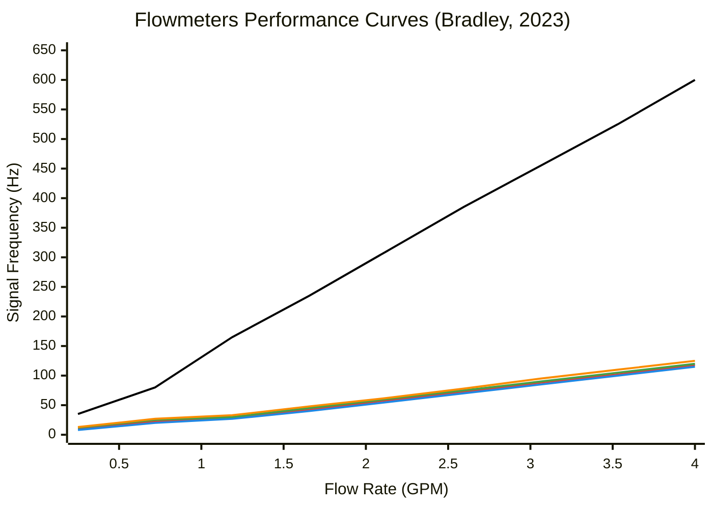
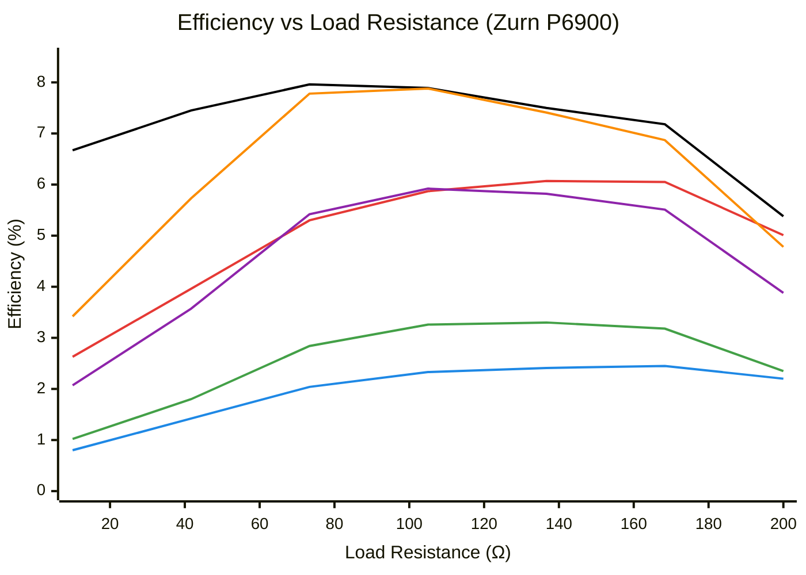
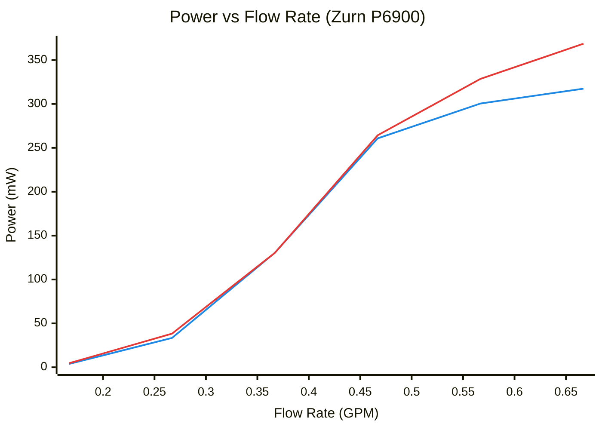
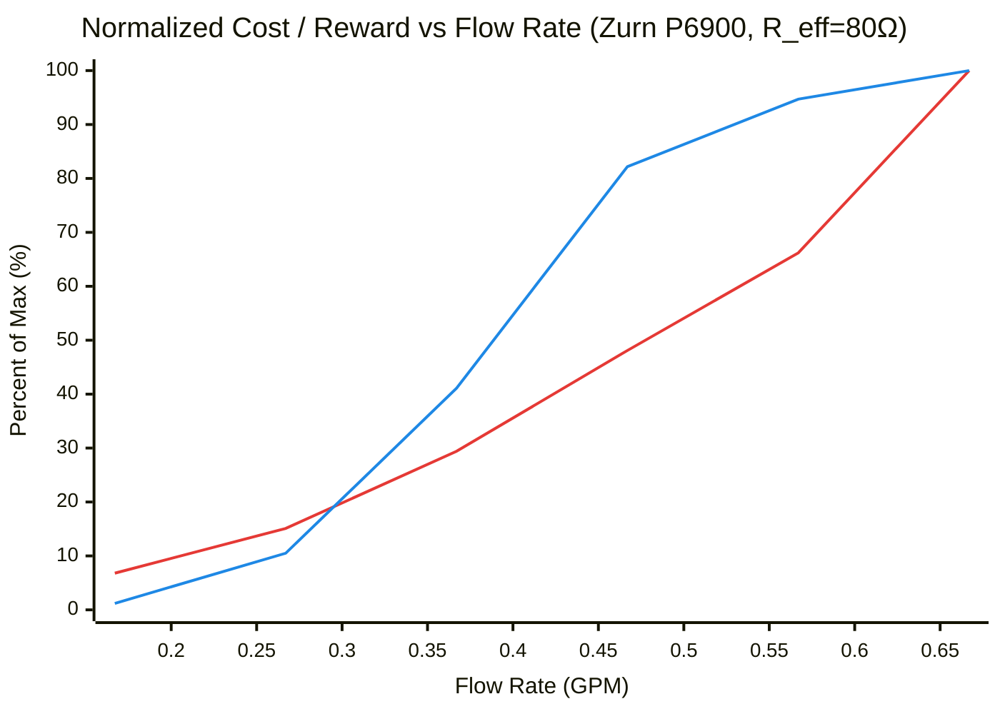
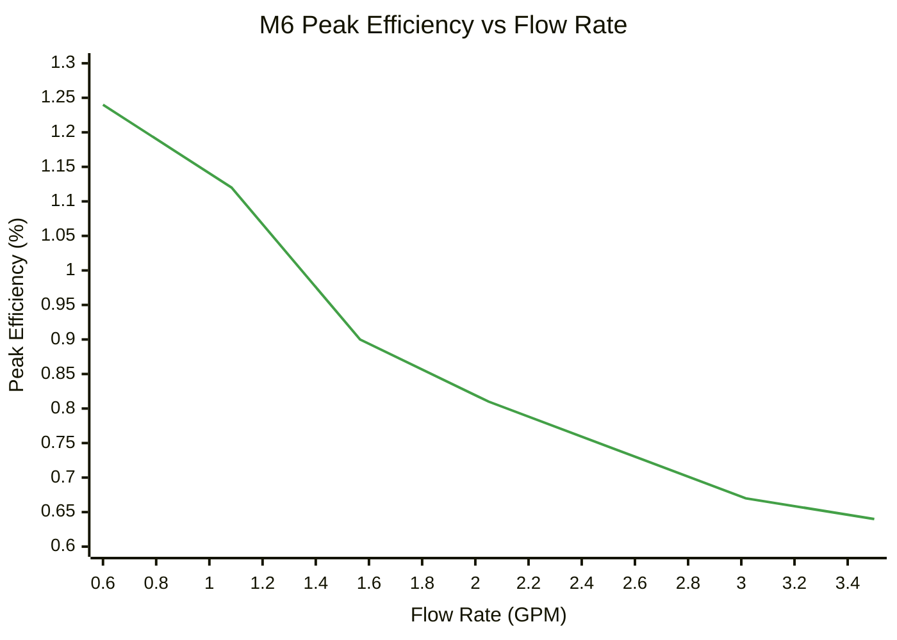
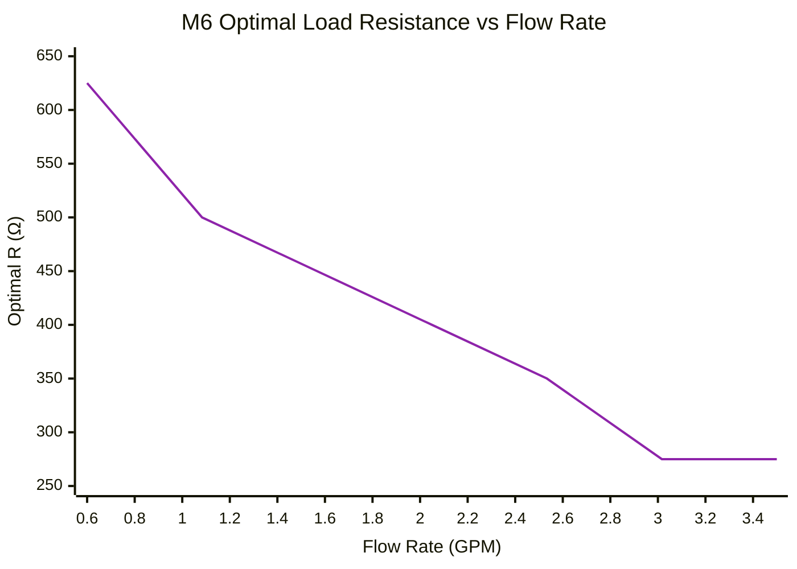

# Rotary Flow Sensing & Power Generation (0 to 4 GPM)

**Watts Water Technologies**

---

## Table of Contents

1. [Overview & Background](#1-overview--background)
2. [Flow Sensing](#2-flow-sensing)
3. [Turbine Generators, Concepts](#3-turbine-generators-concepts)
4. [Bench Testing & Load Selection](#4-bench-testing--load-selection)
5. [Test Results](#5-test-results)
6. [Sensing from a Generator](#6-sensing-from-a-generator)
7. [System Architectures](#7-system-architectures)
8. [Turbine Selection Framework](#8-turbine-selection-framework)
9. [Application Examples](#9-application-examples)
- [Appendix A: Catalogue: Flow Meters](#appendix-b-catalogue-flow-meters)
- [Appendix B: Catalogue: Generators](#appendix-c-catalogue-generators)
---

## 1. Overview & Background

This document is a master reference for **flow sensing and power generation** research at **Watts Water Technologies**. The end goal is **rotary flow sensing in the 0 to 4 GPM range, paired where appropriate with micro-hydro power generation** for sealed or self-powered fixtures. Where wired power or replaceable batteries are acceptable, a dedicated flow meter is sufficient. Where the fixture must be sealed, long-life, or self-powered (which most often shows up in IoT-enabled products), a **micro-hydro turbine generator** is added that both powers the electronics and, optionally, doubles as the flow sensor. Most of this document is about selecting and characterizing those generators.

**Design priorities across all applications:**

- Low cost
- Accurate at low flow rates
- Low power consumption
- Potential for self-powered operation (no wired power, no battery replacement)

### 1.1 Why Rotary? Why 0 to 4 GPM?

The scope is **0 to 4 GPM**, covering bottle fillers, drinking stations, kitchen sinks, restroom sinks, and residential showers. Single fixtures are typically below 2 GPM; the 4 GPM ceiling accommodates multi-fixture configurations (e.g., up to four sinks on one sensor). Within this band, **0 to 1 GPM is treated as ultra-low flow**, where startup torque, bearing drag, and electromagnetic braking dominate behavior. Different turbines are best at different sub-ranges (some peak around 0.25 to 0.33 GPM, others closer to 1 GPM, others only above 2 GPM), and matching that sub-range to the application is a central job of the selection framework.

Rotary sensing measures volume directly by counting spinner revolutions rather than inferring flow from pressure. At low flow, ΔP across any restriction is too small to measure reliably; a spinning turbine at 0.5 GPM produces a clean, countable pulse train. Above 4 GPM, differential pressure sensing takes over.

### 1.2 Prior Work

An initial IoT Technology Readiness Report at Bradley benchmarked and tore down competitor faucets (U by Moen, Delta Essa VoiceIQ), independently confirming the **GEMS 238600** turbine in both and validating it as the optimal sensing element. That report identified differential pressure sensing as viable for higher-flow products (EFX emergency showers at 15 to 30 GPM) and recommended continued research into turbine generators for self-powered applications, which is where this document picks up.

---

## 2. Flow Sensing

### 2.1 Technology Survey

| Technology | Principle | Strengths | Weaknesses | Best Fit |
|---|---|---|---|---|
| **Rotary (Turbine / Paddle)** | Spinning element; RPM ∝ flow | Low cost, good low-flow accuracy | Moving parts, wear | 0.08 to 8 GPM |
| **Positive Displacement** | Fluid fills/empties fixed chambers | Good at low flow | Many moving parts, high ΔP | 0.25 to 2 GPM |
| **Differential Pressure** | ΔP across restriction ∝ Q² | No moving parts, cheap | Poor at low flow | >4 GPM |
| **Ultrasonic** | Transit time of sound | Non-invasive, no ΔP | Expensive, special housing | High accuracy |
| **Magnetic** | Faraday's law on conductive fluid | Non-invasive, accurate | Needs conductive fluid | Industrial |
| **Thermal / Coriolis** | Heat transfer or mass flow | Very accurate | Expensive, power-hungry | Out of scope |
| **Vortex Shedding** | Vortices behind bluff body | Accurate, no moving parts | Min flow >2 GPM, high ΔP | >2 GPM |
| **Vane / Piston** | Spring-loaded vane deflects with flow | Wide range, low-flow capable | Mechanical complexity | Similar to turbine |

### 2.2 Rotary Sensors: Radial vs. Axial

| Type | Description | Min Flow | Notes |
|---|---|---|---|
| Radial / Paddle Wheel | Only part of rotor in flow path | ~0.1 to 0.25 GPM | Cheaper, less accurate at low flow |
| Axial / Inline | Full propeller inline; Hall reads blades | ~0.05 to 0.08 GPM | Better low-flow sensitivity |

Paddle-wheel meters (Gredia, Sea YF-S201, Uxcell) require higher flow to start spinning. Axial turbines (GEMS 238600, Sika VY10, Auk Mueller MT5) offer superior low-flow performance. The **GEMS 238600** was selected as the primary sensing element based on in-house testing and competitor validation.

#### Flowmeter Performance Curves

Signal frequency vs. flow rate is linear ($f = k \cdot Q$) for all rotary meters. The GEMS 238600 produces roughly **4 to 5x the frequency-per-GPM** of any other meter tested, which is the primary reason it was selected: more pulses per unit volume means higher resolution at low flow.

**Legend:**

| | Meter | Slope (Hz / GPM) |
|---|---|---|
| ⬛ | **GEMS 238600** | ~150 |
| 🟥 | Sea YF-S201 | ~30 |
| 🟦 | Gredia FS200A | ~29 |
| 🟩 | Sika VY10 | ~31 |
| 🟧 | Auk Mueller MT5 | ~32 |

*Data reproduced from Bradley in-house testing, 2023.*

### 2.3 Hall Effect Sensors

The turbine's embedded magnet is read by an external Hall effect sensor. The GEMS 238600 emits approximately **100 Gauss** at the sensor zone (measured in-house).

| Sensor | Supply Voltage | Active Current | Active Power | Sleep Current | $B_{OP}$ | $B_{RP}$ | Key Advantage |
|---|---|---|---|---|---|---|---|
| **Allegro A1220** | 3 to 24 V | 4 mA (always on) | ~12 mW @ 3 V | N/A | 35 G typ | 15 G typ | Proven, wide voltage range |
| **Allegro A1171** | 1.65 to 3.5 V | 3.5 to 12 μA | ~15 to 42 μW | 8 μA | 45 G typ | 30 G typ | ~800x lower power than A1220 |

Both operate comfortably with the 100 G field from the GEMS turbine. The **A1171 is preferred for any battery-powered or energy-harvesting application**.

> *Aside:* the A1171 has not yet been bench-validated against a live GEMS turbine in our setup. The 100 G field comfortably exceeds its typical $B_{OP}$ of 45 G on paper, but a confirmation pass with the live turbine should happen before designing it into a product.

> **Shortcut for simple cases:** if the product allows wired power or a replaceable battery, the answer is GEMS 238600 + A1220 (wired) or A1171 (battery). Everything that follows is for the harder case: sealed, long-life, or self-powered deployments where a turbine generator is needed.

---

## 3. Turbine Generators, Concepts

This section covers what generators exist and how they work. Bench testing and selection rules come in §4.

### 3.1 Goals & Operating Range

The goal is to generate usable electrical power from water flow anywhere in the 0 to 4 GPM band, with particular attention to ultra-low flow (0 to 1 GPM) where most off-the-shelf generators struggle. Generators can also double as flow sensors since output frequency and power both scale with flow rate (covered in §6).

### 3.2 Magnet Magnetization

All rotor magnets must be **diametrically magnetized** (N/S poles on opposite sides, perpendicular to the spin axis). As the magnet spins, the field alternates and induces voltage in the stator coils. An axially magnetized magnet spinning on its own axis produces no flux change and no voltage. This is not a design variable; all generators in this catalogue use diametric magnetization.

For low-flow turbines the stator usually surrounds the rotor; partial-admission designs sometimes invert this with the rotor outside the stator.

### 3.3 Admission Types

Both full and partial admission use a directed jet, but differ in geometry and performance:

| Type | Description | Key Characteristic |
|---|---|---|
| **Full Admission** | Tight-tolerance nozzle directs jet around entire rotor circumference; all blades in flow | Lower startup flow, higher ΔP, precise machining |
| **Partial Admission** | Simpler, smaller inlet hole; jet hits only part of rotor at a time | Higher startup flow, lower ΔP, simpler geometry |

Full admission generators can start generating at lower flow rates (critical for ultra-low-flow targets) because of a stronger jet and/or lighter rotor.

### 3.4 Coil Configurations & Flux Types

#### Flux Types

| | Axial Flux | Radial Flux |
|---|---|---|
| **Flux vs rotation axis** | Parallel (along spin axis) | Perpendicular (across spin axis) |
| **Typical coil shape** | Pancake (claw pole) or wrapped cylinder (belt) | Small rings pointing inward, or ring-in-ring |
| **Flux guides needed?** | Yes, always | Typically no |
| **Cycles per revolution** | Magnet pole pairs × claw-pole pairs | Magnet pole pairs |

#### Coil Configurations

| Our Name | Literature Name | Flux | Description | Example |
|---|---|---|---|---|
| **Claw pole** | Claw pole | Axial | Pancake coil above soft-iron claws that funnel flux through the coil | Zurn P6900 |
| **Belt** | Axial flux wrapped | Axial | Coil wraps around rotor cylinder, enclosing the magnet. Best flux coupling of the axial types | Toto EcoPower, Toto 10s Dynamo (EDV462/EDV561) |
| **Spoke** | Hub generator | Radial | Multiple small coils facing inward; magnet ring spins outside (outrunner) | F50 |
| **Gyro** | Radial flux ring | Radial | Ring inside another ring; streamlined for in-pipe mounting | M6 axial propeller |

#### Belt Sub-Categories

- **Single coil:** one electrical circuit, two wires (e.g., Toto EcoPower).
- **Dual coil:** two independent circuits, four wires. One coil dedicated to always-on critical functions (solenoid, MCU); the other powers shed-able functions (display, radio). The Toto 10s Dynamo uses this with a high-inductance secondary coil. Toto advertises that 10 seconds of flow fully initializes the electronics and sustains power briefly after flow stops for clean valve closure. Tradeoff: high inductance increases rotor braking.

#### Three-Phase (Spoke / Hub)

Spoke designs use 3n non-overlapping coils like a motor. Six diodes confirm 3-phase generation (3-phase bridge rectifier). Smoother power delivery and even braking, but reduced ripple is a disadvantage if ripple frequency is being used to infer RPM (see §6.3).

### 3.5 Physics: Power Generation

#### Induced EMF

The peak induced EMF in a rotating coil is

$$\varepsilon_{peak} = N B A \omega$$

where $N$ is the number of coil turns, $B$ is the magnet field strength, $A$ is the coil area, and $\omega$ is the rotor angular velocity. The same $NBA$ product also sets the magnetic braking torque on the rotor, which is why every variable that increases output voltage also increases electromagnetic braking. Two levers help without that penalty:

- **Thicker wire (lower $R_{coil}$):** less power dissipated as heat internally, more delivered to the load.
- **More water pressure:** more torque to overcome braking. Pure energy input.

#### What Drives Output Power

In the **linear region** (moderate $\omega$, no magnetic saturation, rotor not yet braking-limited) output power scales with $V^2$ and therefore approximately with $\omega^2$ and $Q^2$. At higher flow rates this breaks down: voltage flattens as electromagnetic braking, bearing drag, and hydrodynamic losses outpace available torque, so power rises sub-quadratically and asymptotes.

#### Why Each Generator Has a Sweet Spot

At very low flow, friction and bearing losses consume most of the available hydraulic power. As flow increases, output rises. Electromagnetic braking also rises with rotor speed, and at high flow the braking torque becomes significant enough that additional water energy is increasingly wasted. **For most turbines, efficiency therefore peaks at an intermediate flow rate** (the turbine's natural sweet spot). Some turbines, notably axial propellers like the M6, show no interior peak and are simply most efficient at the lowest flow they can support. §4 turns this distinction into the $R_{eff}$ / $R_{max}$ selection rule.

#### Pressure vs. Flow Rate

$$P_{hydraulic} = \Delta P \cdot Q$$

ΔP provides torque; $Q$ provides rotor speed. Both are needed. Output power rises with both at a fixed load but is bounded by the rotor's mechanical limits.

#### Efficiency

$$\eta = \frac{P_{electrical}}{P_{hydraulic}} = \frac{P_{load}}{\Delta P \cdot Q}$$

Since neither term is linear with flow, the efficiency sweet spot is not predictable from geometry alone, hence the bench testing in §4.

### 3.6 Classification System & Family Tree

Turbines are classified by **rotor orientation × admission × flux direction × coil configuration**. These axes are largely independent.

- **Axial rotor (propeller):** spin axis parallel to flow. Always full admission.
- **Radial rotor:** spin axis perpendicular to flow. Can be full or partial admission.

![[Pasted image 20260423205544.png]]
*Legend: 🟦 rotor type · 🟩 admission · 🟧 flux / coil configuration · 🟨 commercial example*

---

## 4. Bench Testing & Load Selection

The goal of testing is twofold: (1) characterize each turbine's general flow behavior (usable flow range, $Q_{start}$, ΔP vs. $Q$, and where the efficiency peak sits if there is one), and (2) pick **one fixed load resistor per turbine** so the rest of the design can treat the turbine as a fixed component. A pre-programmed dynamic load (a small lookup table of resistors switched by flow rate) is a viable alternative that adds a few dollars in BOM and is worth considering for turbines whose optimal $R$ shifts a lot across the operating range; see §4.2 for the comparison and §5.1 Step 2 for a worked example showing how much benefit it actually buys.

> Detailed test rig, procedures, and per-turbine raw data are maintained in a separate **Flow Sensing & Power Generation, Testing & Characterization** document.

### 4.1 What Gets Measured

**Per turbine, once:**

- $R_{coil}$, DC coil resistance
- Teardown geometry: coil ID/OD, pole/claw count, wire gauge. Number of turns $N$ is **estimated** from coil cross-section, wire gauge, and a packing-factor assumption rather than measured directly (counting turns destructively is impractical and not very accurate).

**Per flow rate $Q$, swept 0 to 4 GPM:**

- ΔP under load
- $Q_{start}$, the minimum flow producing any open-circuit voltage
- ΔP$_{oc}$ at open circuit (optional, see note below)
- Full $R_{load}$ sweep, recording $V_{load}$, current, AC frequency $f$, and computed power and efficiency

> **On ΔP$_{oc}$:** open-circuit ΔP vs. $Q$ characterizes the purely hydraulic loss with no electromagnetic braking. Because measured efficiencies are typically under 10% (often under 5%), the electromagnetic component is a small fraction of the total ΔP, and ΔP$_{oc}$ is usually within a few percent of ΔP under load. It's a sanity check, not a critical measurement, and can be skipped on turbines where bench time is limited.

> $B$ (magnet field) and $L$ (inductance) are not directly measurable with current equipment; flux coupling is treated as a single lumped experimental constant from the open-circuit sweep.

> Regulated-DC units (e.g., Zurn P6900) are tested by tapping the raw coil leads upstream of the internal regulator.

### 4.2 The $R_{eff}$ / $R_{max}$ Rule

Picking the resistance that produces the most raw power at a single flow rate is tempting but wrong: that resistance is only optimal at that one flow rate, and at other flow rates within the operating range it gives up significant output. The useful choice is the resistance that balances power output against hydraulic cost across the **whole expected range of flow**, which corresponds to the efficiency peak.

| Symbol | Name | Definition |
|---|---|---|
| **$R_{eff}$** | Peak-efficiency resistance | Single fixed $R$ at which the turbine reaches greatest efficiency across all tested flow rates |
| **$Q_{eff}$** | Peak-efficiency flow rate | Flow rate at which that occurs, the turbine's natural sweet spot |
| **$R_{max}$** | Asymptotic optimal resistance | Used when the minimum tested flow is also the most efficient (no interior sweet spot). The asymptote that optimal $R$ approaches as $Q$ increases |

#### Procedure

1. **Measure $R_{coil}$** with a multimeter. Optimal load will be higher than $R_{coil}$ because of inductive reactance ($\omega L$). True optimum is found in step 3.
2. **Open-circuit baseline.** Sweep flow from zero with leads open; record $Q_{start}$ and (optionally) ΔP$_{oc}$ vs. $Q$.
3. **Efficiency sweep.** At each $Q$, sweep $R_{load}$ and compute $\eta = (V_{load}^2 / R_{load}) / (\Delta P \cdot Q)$. One curve per flow rate.
4. **Identify the peak.**
   - **Interior sweet spot found:** that ($R$, $Q$) is ($R_{eff}$, $Q_{eff}$). Use $R_{eff}$ as the fixed load.
   - **Min flow rate is most efficient:** plot optimal $R$ vs. $Q$; it asymptotes to $R_{max}$. Use $R_{max}$ as the fixed load. Operating point is then driven by pressure budget or power need.

**Sanity check:** the power-vs-flow curve should begin to flatten near $Q_{eff}$, the same electromagnetic saturation that makes high-flow operation wasteful.

**Flatness observation:** $R$ within a reasonable range around the optimum produces only modest changes in power and efficiency. A well-chosen fixed load captures nearly all the available benefit (verified per-turbine in §5).

#### Fixed Load Selection Rule

| Turbine Type | Fixed Load | Notes |
|---|---|---|
| Has interior $Q_{eff}$ | **$R_{eff}$** | Best efficiency at the natural sweet spot |
| Min flow = $Q_{eff}$ | **$R_{max}$** | Selected by pressure budget or power need |

#### Pre-Programmed Dynamic Load (Optional)

A lookup table indexed by flow rate can switch between a small set of resistors, populated from bench data (not real-time tracking). Adds ~$ 2 to $ 5 BOM. Worth considering when the operating range has a large span or if the optimal $R$ shifts dramatically across its range. For most 0 to 4 GPM applications, a fixed $R_{eff}$ or $R_{max}$ captures the large majority of the available benefit, as shown in §5.1 Step 2.

### 4.3 Standard Output: Cost / Reward Chart

Once the fixed load is chosen, each turbine is summarized by a **normalized Cost / Reward chart**:

- **Cost:** ΔP vs. $Q$ (hydraulic cost imposed on the system)
- **Reward:** Power vs. $Q$ at the chosen fixed load (electrical output)

Both are expressed as percent of their turbine-specific maximum, so they share one axis. Conversion factors back to engineering units are given per-turbine in the caption.

---

## 5. Test Results

Two units demonstrate both branches of the selection rule.

### 5.1 Zurn P6900, Interior Sweet Spot ($R_{eff}$ Case)

Primary demonstration unit with complete bench data (full $Q$-sweep × full $R$-sweep). Natively regulated DC; results below were taken with battery and regulator disconnected, tapping the raw coil leads. Concept demonstrator (clean ΔP curvature, clear interior $Q_{eff}$), not a product recommendation.

**Measured:** $R_{coil}$ = 3.6 Ω.

#### Step 1: Efficiency vs. Load Resistance

**Legend:**

| | Flow Rate | Peak $\eta$ |
|---|---|---|
| 🟦 | 0.17 GPM | 2.5% |
| 🟥 | 0.25 GPM | 6.1% |
| ⬛ | **0.33 GPM ($Q_{eff}$)** | **8.0%** |
| 🟧 | 0.42 GPM | 7.9% |
| 🟪 | 0.50 GPM | 5.9% |
| 🟩 | 0.67 GPM | 3.3% |

The global maximum is on the $Q$ = 0.33 GPM curve at $R$ = 80 Ω, $\eta \approx$ 8.0%. **$R_{eff}$ = 80 Ω, $Q_{eff}$ = 0.33 GPM.** Notice the flatness around 80 Ω: small $R$ changes produce only marginal returns.

#### Step 2: Static $R_{eff}$ vs. Dynamic Optimal $R$

With $R_{eff}$ fixed, power vs. flow can be compared against the theoretical ceiling of a continuously-optimized load. The two lines touch at $Q_{eff}$ and separate as $Q$ grows because the optimal $R$ shifts from 80 Ω toward 100 Ω at higher flow. **The flow range over which the two curves track each other closely is the turbine's effective working range under a fixed load**; outside that band, dynamic load-matching would start to provide meaningful gains.

**Legend:**

| | Load Strategy |
|---|---|
| 🟦 | Static load at $R_{eff}$ = 80 Ω |
| 🟥 | Dynamic optimal $R$ per $Q$ (theoretical max) |

The static-load curve captures the large majority of the theoretical maximum across the full operating range, with the largest gap (~14%) at $Q$ = 0.67 GPM, but would continue growing at higher flow rates (limited flow capability on test bench). **For a fixed-load design $R_{eff}$ is robust**; dynamic load chasing isn't worth the BOM and complexity for this margin on the Zurn.

#### Step 3: Cost / Reward Summary

**Legend:**

| | Series | Conversion |
|---|---|---|
| 🟥 | Cost (ΔP as % of 38.5 PSI max) | ΔP [PSI] = cost% × 0.385 |
| 🟦 | Reward (Power at $R_{eff}$ as % of 317.4 mW max) | $P$ [mW] = reward% × 3.174 |

Reward rises steeply through $Q_{eff}$ = 0.33 GPM, hitting 41% of max while Cost is still at 29%. Above $Q_{eff}$, Reward flattens while Cost keeps climbing; the crossover near $Q$ = 0.42 GPM (Cost 48%, Reward 82%) marks where additional flow buys proportionally less electrical return. Lines are suspected to keep diverging at higher flow rates.

### 5.2 M6 Axial Propeller, Asymptotic Case ($R_{max}$)

Full $R$-sweep at seven flow rates (0.60 to 3.50 GPM, $R_{coil}$ = 161.6 Ω) shows **no interior efficiency peak**. Efficiency is highest at the lowest tested flow and decreases monotonically, characteristic of axial-propeller geometry.

Because no single flow rate is best, the load is chosen by looking at the optimal $R$ at each $Q$. Optimal $R$ decreases with increasing $Q$ and approaches an asymptote near 275 Ω.

**$R_{max} \approx$ 275 Ω** is the fixed load selected for the M6. Final operating-point selection is driven by pressure budget and power need rather than a sweet-spot flow rate. M6 peak power ranges from ~3 mW at 0.60 GPM (ΔP ≈ 1 PSI) to ~490 mW at 3.50 GPM (ΔP ≈ 50 PSI), with efficiency steadily degrading.

### 5.3 Side by Side

| | Zurn P6900 | M6 Axial Propeller |
|---|---|---|
| Interior $Q_{eff}$? | Yes (0.33 GPM) | No |
| Fixed load | $R_{eff}$ = 80 Ω | $R_{max} \approx$ 275 Ω |
| Operating point chosen by | $Q_{eff}$ | Pressure budget / power need |
| Static-vs-dynamic gap | Negligible inside operating range | n/a (no interior peak) |

These two demonstrate both branches of the selection rule. All other turbines in the catalogue follow the same workflow as bench data becomes available.

---

## 6. Sensing from a Generator

A turbine generator can double as a flow sensor because output is proportional to rotor speed, which is proportional to flow rate (and voltage in certain cases, power less reliably). This section covers how to extract $Q$ from the generator and which output types support which method.

### 6.1 Generator Output Types

| Output Type | Built-in Circuit | Sensing from electrical terminals? |
|---|---|---|
| **Raw AC** | None | Yes, best option (frequency or voltage-at-load) |
| **Unregulated DC** | Diode bridge | Yes, voltage-at-load; ripple frequency also usable |
| **Regulated DC** | Voltage regulator | **No**, flow info erased at output. Sensing requires opening the housing for an internal Hall (custom assembly only) |

#### Rectification

| Generator Type | Rectification |
|---|---|
| Single-coil, 2-wire | Bridge rectifier + smoothing cap |
| 3-phase hub generator | 3-phase full-wave (6 diodes) |
| Dual-coil, 4-wire | Separate rectification per coil, then combine |

### 6.2 Sensing Methods, in Priority Order
#### 1. Hall sensor inside the turbine body

Reads the rotor magnet directly, same as a dedicated flow meter (§2). Clean digital pulse train, frequency ∝ RPM, load-independent. With an A1171 (~15 to 42 μW) it's the most power-efficient method and cheaper than any PCB chain (op-amp + comparator + filter + ADC) trying to recover $Q$ from the raw generator output. Preferred where physically possible, and the only option for regulated-DC units (after opening the housing).

#### 2. AC or DC ripple frequency

Raw AC zero-crossings or unregulated DC ripple are proportional to $Q$ and load-independent, same as the Hall pulse train. Avoid heavy downstream filtering; it kills ripple amplitude. Useful when the turbine can't fit an internal Hall sensor.

#### 3. Voltage at a fixed load

Voltage tracks RPM and is insensitive to inlet pressure (unlike power). Works on raw AC or unregulated DC. Linear at low to moderate $Q$; saturates at high $Q$ and needs a per-turbine lookup table past that point. Better than power-at-load, worse than frequency.

#### 4. Power at a fixed load and pressure

$P \propto Q^2$ only at constant ΔP. Real plumbing pressure fluctuates with building demand, so the same $Q$ can read differently. Cheapest option (load resistor + voltage measurement) and fine where inlet pressure is stable or accuracy is modest. Not recommended as the primary method when frequency-based options are available.
### 6.3 Open-Circuit Sensing Mode

With no load ($R_{load} = \infty$), electromagnetic braking is removed and the turbine spins more freely, pushing minimum detectable flow below the loaded $Q_{start}$. Flow is read from AC frequency or a Hall sensor. Requires a MOSFET to disconnect the load and a stored energy source (battery or supercap) to power the sensing circuit during this mode.

The system can in principle switch dynamically (open-circuit at very low flow for sensitivity, closed-circuit at higher flow for power generation), but the value is unclear in practice: typical efficiencies are under 10% (often under 5%), and disconnecting the load only reduces ΔP by an estimated 5 to 10%. Whether the gain in low-flow sensitivity justifies the added MOSFET, control logic, and stored-energy buffer is **a question for bench validation per turbine**, not a default architecture.

---

## 7. System Architectures

### 7.1 Output Configurations

Every rotary flowsense decision resolves to one of the following. "Handles 0-flow events" means the system stays responsive when no water is flowing; "Flow minimum with turbine" is the lowest $Q$ at which the turbine path can sense and/or power the system.

| # | Configuration | Sensing | Power | Handles 0-Flow Events | Flow Minimum |
|---|---|---|---|---|---|
| 1 | Flow meter + plug in | Dedicated meter (GEMS + A1220) | Wall Socket | No | Meter sets the floor, ≈ 0.08 GPM |
| 2 | Flow meter + battery | Dedicated meter (GEMS + A1171) | Battery | Yes (sleep) | Meter sets the floor, ≈ 0.08 GPM |
| 3 | Generator as sensor | Power at fixed load, or AC / ripple frequency | Turbine output | No | Loaded $Q_{start}$ (or minimum $Q$ to power circuit) |
| 4 | Generator + internal Hall + cap or battery | Internal Hall (load-independent) | Turbine + small battery | Yes (battery) | Open-circuit $Q_{start}$ (lower than loaded) |
| 5 | Paired  flow meter + generator + battery | Dedicated meter | Turbine + battery trickle-charge | Yes (battery) | Meter floor (≈ 0.08 GPM) |

### 7.2 Operating States & Sleep

The selection of a flowmeter depends heavily not just on the water pressure and flow rate, but the frequency and duration of use. A sink may be used for a few seconds at a time or be unused for an entire day. Measuring a flow rate of 0 takes the same amount of effort measuring any other flow rate, and a turbine can only provide power while its being used. Thus, the active / sleep distinction often dominates total energy budget.

| State | Condition | Power Draw | Power Source |
|---|---|---|---|
| **Active, generating** | Water flowing, load connected | MCU + Hall + radio (5 to 50 mW typical) | Turbine; charges battery in parallel |
| **Active, sensing only** | Water flowing, load open | MCU + Hall only (~0.1 to 1 mW) | Battery; braking minimized for low-flow sensitivity |
| **Sleep** | No flow | MCU deep sleep (~1 to 100 μW) | Battery only |

Switching between Generating and Sensing-Only requires a MOSFET load-disconnect and a battery; it is the same architectural question raised in §6.3 and should be validated per turbine before committing to it.

**Wake from sleep:**

- **Flow-triggered wake (preferred):** low-power comparator monitors Hall signal or raw AC at ~1 to 10 μA quiescent. A detected pulse wakes the MCU.
- **Periodic polling:** MCU wakes on a timer and checks for flow. Simpler firmware but wastes energy during long no-flow periods.

> Specific circuit topology for sleep switching and battery management is out of scope. Design principle: size the battery to cover expected sleep duration at sleep current; size the turbine to replenish it within a normal active flow event.

---

## 8. Turbine Selection Framework

### 8.1 Input Criteria

The selection process matches a product's **water-usage profile** and **power-needs profile** against each turbine's measured Cost / Reward function.

| Input | Description | Default / Notes |
|---|---|---|
| **Flow range (GPM)** | Expected operating range; assume normal distribution | Required |
| **Flow frequency** | How often the fixture sees flow (e.g., bursts/day) | Required |
| **Flow duration** | Typical event length (seconds to minutes) | Required |
| **Power tier** | Sensor only, low-power display, BLE / radio connectivity | Required |
| **Sensing?** | Yes / No (if yes what are accuracy needs)| Required |
| **Pressure budget (PSI)** | Maximum allowable ΔP | Default 50 PSI. Legal min 25, legal max 80 |
| **Price budget** | Max unit cost | Optional; if unknown, use as a visualization axis |

Power tier menu (rough numbers, refine per product):

| Tier | Typical Continuous Power | Notes |
|---|---|---|
| Sensor only | ~0.1 to 1 mW | MCU + Hall only |
|Sensor and other sink functions| ~5 to 10mW|Solenoid and/or hand sensor
| Low-power display | ~10 to 20 mW | Adds LCD or e-ink |
| BLE / radio connectivity | ~20 to 50 mW peak (bursty) | Needs storage to buffer transmits |

### 8.2 Selection Logic

Each turbine has a **Cost function** (ΔP vs. $Q$) and a **Reward function** (power at fixed load vs. $Q$), measured on the bench. Selection is a matching exercise:

1. **Filter by flow range and pressure budget.** Use the Cost portion of each turbine's Cost / Reward chart. Eliminate turbines whose ΔP at the expected flow exceeds budget, or whose usable range doesn't overlap the product's flow distribution.
2. **Match Reward to power tier.** For the expected flow, frequency, and duration, integrate Reward against the power tier requirement. A short, frequent flow event into a BLE-connected node implies large transient draw and benefits from a turbine that hits high power quickly; a long, infrequent event into a sensor-only PID can tolerate a turbine that takes longer to reach steady-state.
3. **Apply sensing requirement.** If sensing is required, confirm the turbine can physically fit a Hall sensor (or that frequency-based sensing on the raw output is acceptable). Regulated-output turbines require Hall + custom housing; power-based sensing alone is not recommended, especially with accuracy constraints (see §6.2).
4. **Apply price filter.**

Step 2 above (matching the turbine's Cost / Reward function to a specific product's water-usage and power-needs profile) is the **next step** in this work, executed once the full catalogue has been bench-characterized. The framework is set up; the data fills in turbine-by-turbine.

### 8.3 Visualization

Plot all turbines on a 2D scatter with axes chosen from the unknowns or trade-offs of interest (e.g., peak power vs. ΔP at expected $Q$, or price vs. peak power). Each point is one turbine. This is the visual companion to the matching process in §8.2 and the most useful single artifact when comparing options for a new product.

A list of suitable applications is built up under each turbine in the catalogue as candidates are eliminated or confirmed by the matching process.

---

## 9. Application Examples

Two Watts product lines are used as worked examples: **Bradley** commercial restroom faucets and **Haws** bottle-filling stations. Both have flow-sensing and/or IoT needs that justify going through the selection process, and both are good candidates for a future-proofed self-powered architecture.

### 9.1 Bradley, Commercial Restroom Faucet

**Context:** Bradley restroom faucets currently lack flow sensing and IoT capability. Adding usage monitoring, anomaly detection, and volume tracking without wired power or battery replacement is the goal. Restroom flow events are short (seconds), frequent (many per day), and clustered around peak hours.

| Input | Value |
|---|---|
| Flow range | 0.5 to 1.5 GPM |
| Flow frequency | TBD |
| Flow duration | Short (~5 to 15 s per event) |
| Power tier | Up to BLE connectivity |
| Sensing? | Yes |
| Pressure budget | 50 PSI (default) |
| Price budget | TBD |

Configuration is open: a turbine with internal Hall sensing and a small buffer battery (config 4 in §7.1) is the most natural fit for IoT, but a "power + frequency sensing" path on a turbine with raw AC output is also viable if the candidate turbine's frequency signal is clean enough at expected flows. Specific recommendation deferred until catalogue $R_{eff}$ / $Q_{eff}$ data is complete.

### 9.2 Haws, Bottle-Filling Station PID and IoT Upgrade

**Context:** Haws bottle-filling stations use replaceable filters with rated gallon limits. A **Performance Indicating Device (PID)** is required under NSF/ANSI 42 (§5.3.2) and NSF/ANSI 53 (§6.3.2). PID requirements:

- Track **actual water volume** by physical displacement (rotating turbine or positive-displacement). Time-based estimation does not qualify.
- Built-in, not aftermarket.
- Operates automatically; manually resettable after filter replacement.
- Non-adjustable end-of-life setpoint.
- Distinct visual or audible end-of-life indicator (NSF doesn't mandate a specific color but requires a distinct warning state).

Per NSF/ANSI 53, a certified PID allows filter life testing to 120% of rated capacity rather than 200% without one.

Current solution: **Digiflow 8100T-22** ($17.33, 2x AA, ~3-year life replaced with the filter 2,000 gallons, LCD display).

**Two goals at different price points:**

| Goal | Description |
|---|---|
| **Cost reduction** | Compliant rotary-turbine PID for less than $17.33 |
| **IoT upgrade** | Add cloud connectivity using flow-generated power, beyond what 2x AA supports |

| Input | Value |
|---|---|
| Flow range | 0.5 to 1.6 GPM |
| Flow frequency | TBD |
| Flow duration | Medium (15-30 seconds) |
| Power tier | PID only (sensor + LCD): ~3 mW active / ~45 μW sleep. IoT tier: BLE, TBD |
| Sensing? | Yes (cumulative gallon count required) |
| Pressure budget | 50 PSI (default; confirm Haws inlet spec) |
| Price budget | < $17.33 cost-reduction; relaxed for IoT |

Flow range overlaps Bradley closely so the same candidate turbines apply. The cost-reduction goal is sensing-dominant and could be served by config 1 or a low-cost turbine in config 3. The IoT goal requires sustained BLE plus trickle-charging during sleep, pointing toward config 4 or 5. As with Bradley, final selection comes out of the matching exercise in §8.2.

## Appendix A: Catalogue: Flow Meters

![[Pasted image 20260424110120.png]]

---

## Appendix B: Catalogue: Generators

![[Pasted image 20260424105619.png]]

